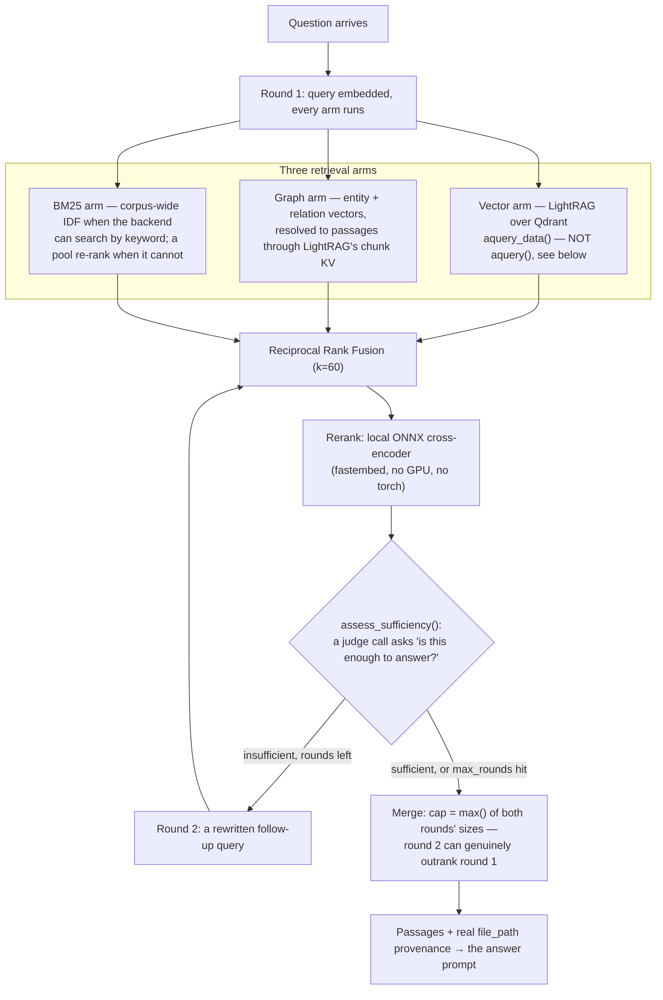

# Retrieval

## What it is

The system that finds the right passages from a tenant's own documents to
answer a question — hybrid **vector** search (meaning-based) fused with
**graph** search (entity/relation-based), reranked, and returned with real
provenance. If you have never built retrieval-augmented generation before:
the core idea is that instead of asking a model to answer from memory
(where it can confidently make things up), you first find the actual
passages that are relevant, hand those to the model, and require the answer
to be grounded in them.

## Why it exists here

A single retrieval technique has known weak spots — pure vector search
misses exact-keyword matches and struggles with multi-hop questions ("which
policy applies to the customer who filed complaint X"); pure keyword search
misses paraphrases. Aegis fuses two retrieval arms and adds an **agentic**
second round for genuinely hard questions, plus a local reranker so the
final ordering is not just whichever arm happened to score a passage
highest.

## Diagram



## The architecture

```
aegis/src/aegis/retrieval/
  pipeline.py         Retriever — runs the arms, fuses, reranks, assembles RetrievalResult
  lightrag_backend.py the LightRAG wrapper — aquery_data(), tenant tagging, _scoped_recall
  fusion.py           reciprocal_rank_fusion(), collect_origins()
  local_reranker.py   the local ONNX cross-encoder (primary)
  reranker.py         the LLM-as-reranker fallback, behind it
  agentic.py          the multi-round sufficiency loop, capped by max_rounds
  query_rewrite.py    the cheap-model rewrite that runs before recall
  vector_store.py     Qdrant client wrapper
  chunk_index.py      publish_chunk_points — the deterministic point-id scheme for chunks
  graph_index.py      the entity/relation counterpart: publish_vectors for the graph arm
  graph_extract.py    spaCy-based entity/relation extraction (see ingestion.md)
  spotlight.py        marks retrieved text as data, not instructions
  answer_cache.py     the semantic answer cache, read and written by the agent graph
  types.py            RetrievalChunk, ScoredSource, RetrievalResult, Provenance
```

## What is actually in Aegis

### LightRAG does the storage and the low-level query; Aegis wrote the rest

LightRAG is the underlying library managing the Qdrant-backed vector and
graph storage and the base query mechanics. Everything around it — fusion
across arms, reranking, the agentic sufficiency loop, tenant tagging, and
turning results into the platform's own typed `RetrievalResult` — is Aegis
code.

### `aquery_data`, not `aquery` — and why the difference mattered

LightRAG offers two query methods with the same underlying retrieval:
`aquery()` returns a single **prompt-shaped string** merging every matched
passage into one blob, discarding each passage's own `file_path`.aquery
**data** returns the same retrieval as a **structured mapping**
(`{status, message, data: {entities, relationships, chunks}}`) with
per-element `file_path` preserved.

This is a real defect that shipped and was fixed in this project: using
`aquery()` meant every retrieved passage arrived as one unattributable
blob, so the scoping/provenance layer had nothing to attribute per-chunk —
retrieval technically worked but **every tenant-scoped query failed**
because there was no `file_path` to verify a chunk against. The test suite
stayed green through this because its fake backend returned a shape
LightRAG has never actually returned. Switching to `aquery_data()` restored
per-chunk `file_path`, and — as a side effect — restored graph nodes/edges
too, which had been silently empty on the string-returning path.

### The graph arm — inert by construction until 2026-08-23

This is the most useful thing to know about this module, because the failure was
invisible: **hybrid retrieval ran two arms and one of them returned nothing**,
and had done since the corpus was built.

The cause was a consequence of a correct decision made elsewhere.
`chunk_index.publish_vectors` deliberately bypasses LightRAG's `ainsert` — fed
finished chunks, LightRAG treats each as a document sharing one filename and
silently rejects all but the first as duplicates (there are 73 `FAILED` rows in
the database from when that happened) — and writes chunk points directly under
LightRAG's own addressing contract. Nobody had ever done the equivalent for
**entities and relations**, so `lightrag_vdb_entities` held 0 points and the
graph arm matched nothing.

Three pieces had to land together, and any one alone would have looked like it
should have worked:

1. **`graph_index.py`** — the entity/relation counterpart of `chunk_index.py`,
   built to LightRAG's exact contract because a key or content shape that is
   slightly off produces points that exist and never match: `"ent-"+md5(name)`,
   `"rel-"+md5(src+tgt)` with the endpoints **sorted first** (LightRAG's
   `operate.py` does this, so one edge is one record whichever way the extractor
   phrased it).
2. **LightRAG's chunk key-value table**, which is how it resolves a matched
   entity back to a passage. It held 0 rows for the same reason.
3. **`source_id` on the graph node itself.** `operate.py` reads `source_id` off
   the **node**, not off the vector payload, and the Neo4j projection never wrote
   one — which is what emitted *"No entities with text chunks found"* before the
   KV was ever consulted.

The points are shaped from `projection_rows`, the same pure function that built
the Neo4j nodes, so a vector's `entity_name` cannot drift from its node's
`entity_id`. A mismatched name is dropped silently by LightRAG, which is the
failure this removes rather than guards against. Counts are what the store
**confirmed**, read back by exact point id — never what was sent.

Failure is neither fatal nor silent: with Qdrant pointed at a dead port the
stage completes and reports `entity_vectors: null, graph_vectors: "failed:
Connection refused"` — an honest unknown, never a fabricated zero.

A corpus that predates any of this is repaired with
`python -m app.ingestion --reindex` then `--backfill-graph`, in that order.

### Fusion — Reciprocal Rank Fusion, `k=60`

`reciprocal_rank_fusion()` combines the arms' rankings using the standard RRF
formula with damping constant `k=60` — a passage's fused score is the sum of
`1/(k + rank)` across every arm it appeared in, so a passage ranked highly by
*several* arms outranks one ranked highly by only one. `collect_origins()` then
reports which arms actually produced a surviving candidate, which is what a
console shows as `origins: ["vector","graph","bm25"]`.

**The BM25 arm reports two honestly-different things and refuses to blur them.**
If the backend implements `KeywordBackend`, BM25 runs over the **whole corpus**
with corpus-wide IDF; it can surface a document no other arm returned, so it is a
real recall arm, tagged `BM25` and present in `provenance.origins`. If it cannot,
all that can be scored is the pool the other arms already recalled — perhaps 20
documents. That reorders the pool (worth doing, and RRF still fuses it) but it
**cannot add recall**, and IDF over 20 documents is not a corpus statistic, so
the list carries **no origin** and the pass is reported as what it is:
`KeywordReport(scope="pool", adds_recall=False)`.

### Reranking — a real local model, not a hosted API, and why

`fastembed`'s ONNX `TextCrossEncoder`, running the model architecture behind
`jinaai/jina-reranker-v1-tiny-en`. The source's own comment corrects a
prior assumption directly: *"local cross-encoder" was treated as a synonym
for "needs a GPU and a heavy model." It is not* — this ONNX model needs no
GPU and pulls no torch dependency, which is why it is viable on the
project's 16 GB no-GPU reference machine. `RerankOutcome` separately reports
whether reranking **ran** versus whether it actually **graded** results, so
a deployment missing the cached model file (an air-gapped box, say) has a
tested, honest fallback path rather than a silent no-op.

### Agentic retrieval — a bounded second round, not open-ended

For a question the first round's passages do not clearly answer,
`assess_sufficiency()` makes one judge call asking "is this enough?" If not,
and rounds remain, a **rewritten follow-up query** runs a second retrieval
round. This is capped by `max_rounds` so it structurally cannot run away
into an unbounded loop.

**The merge is deliberately not "round 1, plus whatever round 2 added."**
The cap on the merged result size is the **larger** of the two rounds'
natural sizes, never round 1's alone — the source is explicit that capping
at round 1's size would make it *structurally impossible* for round 2 to
ever outrank round 1, defeating the entire point of running a second round.
Everything the second round measured — origins, scores — is recomputed
from the actual merged result rather than assumed to still hold.

### Tenant isolation at recall time

Retrieval is scoped the same way memory is (see `memory.md`): every query
against LightRAG's Qdrant-backed storage carries the caller's tenant scope,
and the point-id scheme in `chunk_index.py` tags each published chunk with
its owning tenant.

The load-bearing detail is that **the boundary is crossed and then refused, not
merely absent**. Verified live under a query that *would* have matched: LightRAG
itself matched 12 entities and 17 chunks for tenant 2, and
`lightrag_backend._scoped_recall` dropped all 17 on the tenant tag. Northwind
answers from the escalation runbook; Vertex answers "I cannot answer — no
matching requests". A test that only shows the second tenant getting nothing
cannot tell the difference between isolation and an empty index.

**The graph API had the same class of bug twice, both fixed on 2026-08-22/23**,
and both are worth knowing because neither logged anything:

- `GET /v1/graph` returned `{"nodes":[],"edges":[]}` over a Neo4j holding 122
  nodes and 272 edges. LightRAG's Neo4j backend resolves its node label from
  `NEO4J_WORKSPACE`, else the workspace it was constructed with, else `"base"`.
  The writer implemented only the first and the last, and every `.env` here sets
  `WORKSPACE` and not `NEO4J_WORKSPACE` — so the reader matched on the run's own
  label while the writer had labelled everything `base`. Fully written, entirely
  invisible, and the ingest stage was right to report success.
- The same endpoint unions Neo4j's durable graph with an in-process delta of what
  recent runs retrieved. The durable half was provenance-checked; **the delta was
  keyed by persona alone**, and every admin tier shares one persona, so one
  tenant's live retrieval slice rendered in another's graph — 78 nodes on
  `vertex.admin`, growing with tenant 1's traffic.

## How it runs

1. A question is embedded and every arm (vector via LightRAG, graph, BM25)
   queries in round 1.
2. Results are fused with RRF and reranked with the local ONNX
   cross-encoder.
3. A judge call assesses whether the fused, reranked result is sufficient
   to answer.
4. If not, and rounds remain, a rewritten follow-up query runs a second
   round, merged with the first using the max-of-both-sizes cap.
5. The final passages, each carrying real `file_path` provenance from
   `aquery_data()`, are handed to the answer-generation step.

## What is not here

- **No hosted reranking API** — the reranker is a local ONNX model,
  deliberately, to avoid an external round trip and a GPU requirement.
- **The agentic loop is capped, not adaptive to a difficulty estimate** —
  `max_rounds` is a fixed ceiling, not a value the system tunes per
  question.
- **Retrieval quality depends entirely on what ingestion actually
  extracted** — this module cannot recover context that never made it into
  a chunk in the first place; see `ingestion.md` for the quality gate on
  that upstream step.
- **Nothing prunes or reconciles the graph arm's three stores against each
  other.** Entity vectors, the chunk KV and the Neo4j projection are written by
  the same stage but can be repaired independently, and only
  `python -m app.ingestion --verify` will tell you they disagree.
- **One known ingest limit, reported rather than hidden:** on a whole-corpus
  `--backfill-graph`, a document large enough to exceed the embedding gateway's
  per-call timeout makes the command exit 1 naming that document, instead of
  claiming success. Backfilling it alone completes.
