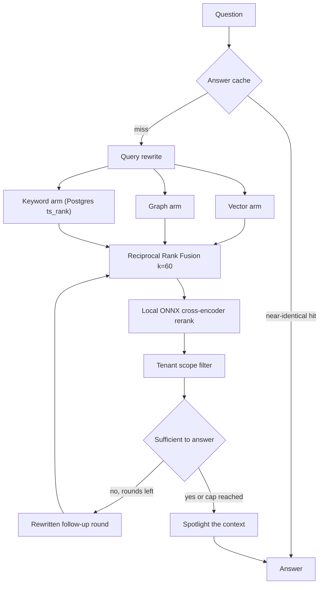

# Retrieval

## What it is

The system that finds the right passages from a tenant's own documents to
answer a question. Three independent search arms run, their rankings are
fused, the survivors are reranked, and the result comes back with real
per-passage provenance.

This is the "R" in retrieval-augmented generation: rather than let a model
answer from memory, find the actual passages first and require the answer to
be grounded in them.

## Why it exists

One search technique is never enough. Vector search finds paraphrases but
misses exact identifiers. Keyword search finds identifiers but misses
paraphrases. Graph search answers multi-hop questions ("which policy covers
the customer who filed complaint X") that neither of the others can. An
enterprise platform also has to prove that a passage shown to tenant A came
from tenant A's own corpus, which is why provenance is carried per passage
rather than merged into one blob.

## Diagram

## How it works

1. **Answer cache.** A near-identity semantic cache in Redis is checked
   first. The similarity bar is deliberately high (`ANSWER_CACHE_THRESHOLD`,
   default `0.97`) so it acts as an exact-repeat shortcut, not a quality
   gamble. Entries are keyed per tenant scope.
2. **Query rewrite.** A cheap-model call rewrites the question with
   conversation context before recall.
3. **Three arms run.**
   - **Vector** — LightRAG over Qdrant, called through `aquery_data()`, which
     returns a structured mapping (`entities`, `relationships`, `chunks`) with
     each element's own `file_path` preserved.
   - **Graph** — entity and relation vectors, resolved back to passages
     through LightRAG's chunk key-value table in Postgres.
   - **Keyword** — corpus-wide when the backend implements `KeywordBackend`,
     otherwise a re-ranking of the pool the other arms already recalled. On
     the shipped Postgres path this is full-text search over the `search_vector`
     tsvector, ranked by `ts_rank`.
4. **Fusion.** `reciprocal_rank_fusion()` sums `1/(k + rank)` across the arms
   a passage appeared in, with `k = 60`. **RRF** — reciprocal rank fusion —
   is rank-based and weightless: a passage ranked well by several arms beats
   one ranked well by only one, and no arm carries a tuning weight.
5. **The keyword arm reports what it actually is.** A corpus-wide keyword pass
   is a real recall arm, listed in `provenance.origins`. A pool-scoped pass
   reorders but cannot add recall, so it is fused, carries **no** origin, and is
   reported as `KeywordReport(scope="pool", adds_recall=False)`.

   **And it is not Okapi BM25.** The wire value of `RetrievalOrigin` is still
   `bm25` — it is on the wire in three packages and in stored provenance rows,
   so changing it would rewrite history — but the shipped Postgres
   implementation is `ts_rank`, which has two of BM25's three ideas and not the
   third. Term-frequency saturation and length normalisation are there; **IDF is
   not**, so nothing here weights a rare identifier above a common word. A
   passage ranks above another because it covers more of the query's terms, not
   because the terms it covers are rarer. The console renders the arm as
   **"Keyword (ts_rank)"** rather than "BM25" for exactly that reason. RRF fuses
   on *rank*, not score, so the missing IDF costs ordering quality **within**
   this arm and nothing across arms.

   `ts_rank` rather than `ts_rank_cd`, and that was measured: `ts_rank_cd` is
   proportional to the number of covers, so a passage repeating one common query
   word four times outranks the passage that actually carries the identifier —
   the exact failure this arm exists to fix.

   The in-memory backend (`aegis.retrieval.memory`, used by the eval harness and
   the ablation ladder) *does* implement real BM25, which is why the ablation
   table names BM25 and this page does not.
6. **Rerank.** `fastembed`'s ONNX `TextCrossEncoder` re-scores the fused list.
   It runs locally, needs no GPU and pulls no torch dependency. `RerankOutcome`
   separately reports whether reranking *ran* and whether it actually *graded*,
   so a box without the cached weights has an honest fallback.
7. **Scope filter.** `_scoped_recall` drops every candidate, graph node and
   graph edge whose tenant tag does not match the caller's scope.
8. **Agentic round two.** `assess_sufficiency()` makes one judge call asking
   whether the passages answer the question. If not, and rounds remain
   (`agentic_max_rounds`, default `2`), a rewritten follow-up query runs a
   second round. The merged cap is the **larger** of the two rounds' sizes, so
   round two can genuinely outrank round one.
9. **Spotlight.** `build_spotlighted_context` marks the retrieved text as
   data rather than instructions before it reaches the answer prompt — the
   prompt-injection defence.

## What it stores

This module owns no relational tables. It reads and writes these stores:

| Store | Name | Holds |
| --- | --- | --- |
| Postgres | `chunks` | chunk text, its 3072-dim embedding, `tenant_id`, `document_id`, and a generated `search_vector` tsvector for keyword search |
| Postgres | `lightrag_doc_chunks` | LightRAG's chunk key-value table, how a matched entity resolves back to a passage |
| Qdrant | `lightrag_vdb_chunks` | chunk vectors, point ids derived from the chunk's LightRAG key |
| Qdrant | `lightrag_vdb_entities` | entity vectors, point id `"ent-" + md5(name)` |
| Qdrant | `lightrag_vdb_relationships` | relation vectors, point id `"rel-" + md5(src+tgt)` with endpoints sorted first |
| Neo4j | the knowledge graph | entity nodes and relation edges, each node carrying `source_id` |
| Redis | the answer cache | one entry per (scope, query), plus a per-scope index set |

The `chunks` table is written by ingestion; retrieval is a reader of it.

## Security and tenant isolation

- Every published vector carries a tenant tag under the payload key
  `tenant_id`, in the exact shape `t<number>`. Anything else is refused rather
  than interpreted.
- `RetrievalScope` resolves to exactly one tenant or to the explicit
  `ALL_TENANTS` platform authority. There is no `None` that could silently
  mean "no predicate".
- `_scoped_recall` filters candidates **and** graph nodes **and** graph edges.
  A node label is an entity name lifted from a document and an edge relation
  is a sentence the extractor wrote, so both are document content.
- If a tenant-scoped request receives LightRAG's whole-context fallback — a
  blend with no per-chunk path — the call raises rather than serving it. It
  cannot be shown to belong to this tenant, so it is neither served nor
  silently dropped.
- `chunks` is registered for Postgres row-level security and carries its own
  `tenant_id` rather than reaching one through `documents`.
- The answer cache folds the tenant scope into every key, so one tenant's
  cached answer is unreachable from another's scope.

## API surface

No HTTP routes of its own. Retrieval runs inside the agent graph
(`POST /v1/query`). The one related endpoint is `GET /v1/graph` (any
authenticated caller), which returns the tenant's knowledge graph slice.

## Configuration

| Variable | Default | Effect |
| --- | --- | --- |
| `QDRANT_URL` | `http://localhost:6333` | the Qdrant node every vector consumer shares |
| `QDRANT_API_KEY` | `""` | key for a secured Qdrant node |
| `VECTOR_STORE_PATH` | `vector_storage` | LightRAG's local working directory |
| `NEO4J_URI` | `bolt://localhost:7687` | graph store |
| `NEO4J_USER` / `NEO4J_PASSWORD` | `neo4j` / `""` | graph credentials |
| `REDIS_URL` | `redis://localhost:6379/0` | answer-cache backend |
| `QUERY_REWRITE_ENABLED` | `true` | run the pre-recall rewrite |
| `AGENTIC_RETRIEVAL_ENABLED` | `true` | allow the sufficiency loop |
| `AGENTIC_RETRIEVAL_MAX_ROUNDS` | `2` | ceiling on retrieval rounds |
| `ANSWER_CACHE_ENABLED` | `true` | enable the semantic answer cache |
| `ANSWER_CACHE_THRESHOLD` | `0.97` | similarity a cache hit must clear |
| `ANSWER_CACHE_TTL_SECONDS` | `1800` | cache entry lifetime |
| `RERANK_LOCAL` | `true` | use the local cross-encoder; `false` demotes to the API reranker |
| `STORES` | `on` | `off` swaps in an in-memory backend with no databases |

## Where it lives

| Path | What it does |
| --- | --- |
| `aegis/src/aegis/retrieval/pipeline.py` | `Retriever` and `RetrievalConfig`; runs the arms, fuses, reranks, assembles the result |
| `aegis/src/aegis/retrieval/lightrag_backend.py` | the LightRAG wrapper, tenant tagging, `_scoped_recall` |
| `aegis/src/aegis/retrieval/fusion.py` | `reciprocal_rank_fusion()` and `collect_origins()` |
| `aegis/src/aegis/retrieval/local_reranker.py` | the local ONNX cross-encoder |
| `aegis/src/aegis/retrieval/reranker.py` | the LLM-as-reranker fallback |
| `aegis/src/aegis/retrieval/agentic.py` | the bounded multi-round sufficiency loop |
| `aegis/src/aegis/retrieval/query_rewrite.py` | the cheap-model rewrite |
| `aegis/src/aegis/retrieval/vector_store.py` | the Qdrant client wrapper |
| `aegis/src/aegis/retrieval/chunk_index.py` | chunk point ids, publication, and `prune_stale_chunk_points` |
| `aegis/src/aegis/retrieval/graph_index.py` | entity and relation point ids and publication |
| `aegis/src/aegis/retrieval/graph_extract.py` | entity and relation extraction |
| `aegis/src/aegis/retrieval/spotlight.py` | marks retrieved text as data, not instructions |
| `aegis/src/aegis/retrieval/answer_cache.py` | the Redis semantic answer cache |
| `aegis/src/aegis/retrieval/citations.py` | citation assembly from provenance |
| `aegis/src/aegis/retrieval/types.py` | `RetrievalScope`, `AllTenants`, origins, tenant tag rules |
| `aegis/src/aegis/retrieval/models.py` | `RetrievalResult`, `Provenance`, the per-arm reports |

## What it does not do

- **No Okapi BM25 on the production path.** The keyword arm is Postgres
  `ts_rank` and carries no IDF term. A real BM25 index was rejected on
  tenant-isolation and dependency grounds; the arm reports what it is instead of
  what its wire value is called.
- No hosted reranking API. The reranker is a local ONNX model.
- The agentic loop has a fixed ceiling; it does not tune rounds per question.
- It cannot recover context that ingestion never extracted.
- Nothing reconciles the three graph stores against each other. Entity
  vectors, the chunk key-value table and the Neo4j projection are written by
  one stage but repaired independently; `python -m app.ingestion --verify`
  is what reports a disagreement.
- Retrieval does not write to `chunks`. That is ingestion's job.
