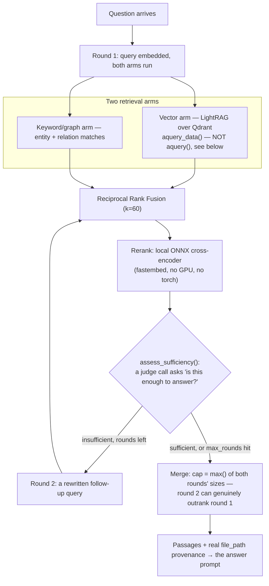

# Retrieval

## What it is

The system that finds the right passages from a tenant's own documents to
answer a question — hybrid **vector** search (meaning-based) fused with
**graph** search (entity/relation-based), reranked, and returned with real
provenance. If you have never built retrieval-augmented generation before:
the core idea is that instead of asking a model to answer from memory
(where it can confidently make things up), you first find the actual
passages that are relevant, hand those to the model, and require the answer
to be grounded in them.

## Why it exists here

A single retrieval technique has known weak spots — pure vector search
misses exact-keyword matches and struggles with multi-hop questions ("which
policy applies to the customer who filed complaint X"); pure keyword search
misses paraphrases. Aegis fuses two retrieval arms and adds an **agentic**
second round for genuinely hard questions, plus a local reranker so the
final ordering is not just whichever arm happened to score a passage
highest.

## Diagram



## The architecture

```
aegis/src/aegis/retrieval/
  pipeline.py         Retriever — assembles the final RetrievalResult
  lightrag_backend.py the LightRAG wrapper — aquery_data(), tenant tagging
  fusion.py           reciprocal_rank_fusion()
  rerank.py           the local ONNX cross-encoder path
  agentic.py           the multi-round sufficiency loop, capped by max_rounds
  vector_store.py     Qdrant client wrapper
  chunk_index.py      publish_chunk_points, the deterministic point-id scheme
  graph_extract.py    spaCy-based entity/relation extraction (see ingestion.md)
  types.py            RetrievalChunk, ScoredSource, RetrievalResult
```

## What is actually in Aegis

### LightRAG does the storage and the low-level query; Aegis wrote the rest

LightRAG is the underlying library managing the Qdrant-backed vector and
graph storage and the base query mechanics. Everything around it — fusion
across arms, reranking, the agentic sufficiency loop, tenant tagging, and
turning results into the platform's own typed `RetrievalResult` — is Aegis
code.

### `aquery_data`, not `aquery` — and why the difference mattered

LightRAG offers two query methods with the same underlying retrieval:
`aquery()` returns a single **prompt-shaped string** merging every matched
passage into one blob, discarding each passage's own `file_path`.aquery
**data** returns the same retrieval as a **structured mapping**
(`{status, message, data: {entities, relationships, chunks}}`) with
per-element `file_path` preserved.

This is a real defect that shipped and was fixed in this project: using
`aquery()` meant every retrieved passage arrived as one unattributable
blob, so the scoping/provenance layer had nothing to attribute per-chunk —
retrieval technically worked but **every tenant-scoped query failed**
because there was no `file_path` to verify a chunk against. The test suite
stayed green through this because its fake backend returned a shape
LightRAG has never actually returned. Switching to `aquery_data()` restored
per-chunk `file_path`, and — as a side effect — restored graph nodes/edges
too, which had been silently empty on the string-returning path.

### Fusion — Reciprocal Rank Fusion, `k=60`

`reciprocal_rank_fusion()` combines the vector and keyword/graph arms'
rankings using the standard RRF formula with damping constant `k=60` — a
passage's fused score is the sum of `1/(k + rank)` across every arm it
appeared in, so a passage ranked highly by *both* arms outranks one
ranked highly by only one.

### Reranking — a real local model, not a hosted API, and why

`fastembed`'s ONNX `TextCrossEncoder`, running the model architecture behind
`jinaai/jina-reranker-v1-tiny-en`. The source's own comment corrects a
prior assumption directly: *"local cross-encoder" was treated as a synonym
for "needs a GPU and a heavy model." It is not* — this ONNX model needs no
GPU and pulls no torch dependency, which is why it is viable on the
project's 16 GB no-GPU reference machine. `RerankOutcome` separately reports
whether reranking **ran** versus whether it actually **graded** results, so
a deployment missing the cached model file (an air-gapped box, say) has a
tested, honest fallback path rather than a silent no-op.

### Agentic retrieval — a bounded second round, not open-ended

For a question the first round's passages do not clearly answer,
`assess_sufficiency()` makes one judge call asking "is this enough?" If not,
and rounds remain, a **rewritten follow-up query** runs a second retrieval
round. This is capped by `max_rounds` so it structurally cannot run away
into an unbounded loop.

**The merge is deliberately not "round 1, plus whatever round 2 added."**
The cap on the merged result size is the **larger** of the two rounds'
natural sizes, never round 1's alone — the source is explicit that capping
at round 1's size would make it *structurally impossible* for round 2 to
ever outrank round 1, defeating the entire point of running a second round.
Everything the second round measured — origins, scores — is recomputed
from the actual merged result rather than assumed to still hold.

### Tenant isolation at recall time

Retrieval is scoped the same way memory is (see `memory.md`): every query
against LightRAG's Qdrant-backed storage carries the caller's tenant scope,
and the point-id scheme in `chunk_index.py` tags each published chunk with
its owning tenant so a cross-tenant read has nothing matching to return —
verified live in this project: asking tenant 2 a question only tenant 1's
document could answer returns zero candidates, and the reranker scores what
little tenant 2's own documents *do* surface as negative.

## How it runs

1. A question is embedded and both arms (vector via LightRAG, keyword/graph)
   query in round 1.
2. Results are fused with RRF and reranked with the local ONNX
   cross-encoder.
3. A judge call assesses whether the fused, reranked result is sufficient
   to answer.
4. If not, and rounds remain, a rewritten follow-up query runs a second
   round, merged with the first using the max-of-both-sizes cap.
5. The final passages, each carrying real `file_path` provenance from
   `aquery_data()`, are handed to the answer-generation step.

## What is not here

- **No hosted reranking API** — the reranker is a local ONNX model,
  deliberately, to avoid an external round trip and a GPU requirement.
- **The agentic loop is capped, not adaptive to a difficulty estimate** —
  `max_rounds` is a fixed ceiling, not a value the system tunes per
  question.
- **Retrieval quality depends entirely on what ingestion actually
  extracted** — this module cannot recover context that never made it into
  a chunk in the first place; see `ingestion.md` for the quality gate on
  that upstream step.
