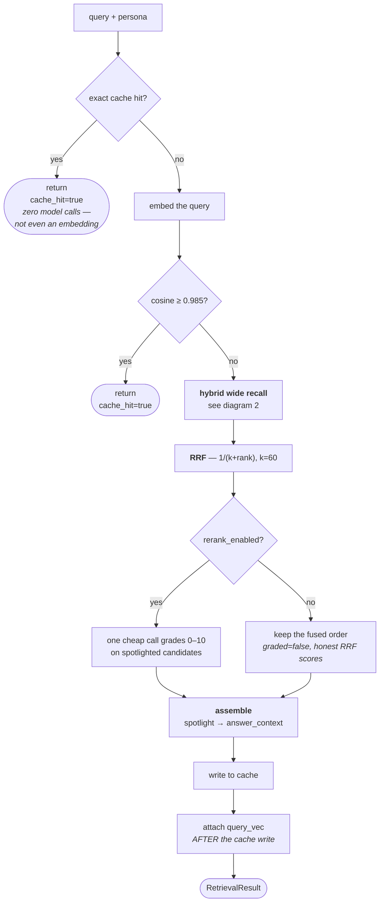
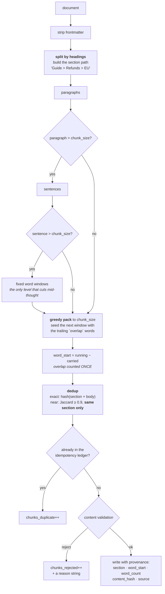
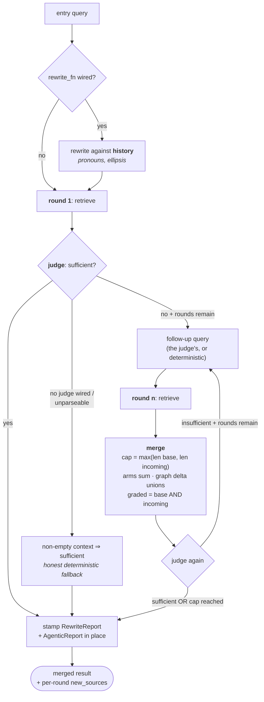
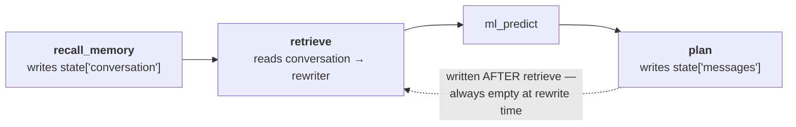

# Retrieval — the diagrams

Five diagrams. The two worth reproducing from memory are **the hybrid recall fan-out** and
**the ingestion pipeline** — between them they carry most of a long conversation about this
module.

Everything else is explained in [`10-guide.md`](10-guide.md); a picture is only here when it
shows something prose cannot.

---

## 1. The retrieve path

*Look at the two places the pipeline returns early, and at where `query_vec` gets attached.*

The exact-cache branch returns **before** the embedding call, so the cheapest possible query
costs nothing at all.

`query_vec` is attached after the cache write, so the serialised cache never stores a
3072-float blob and a later cache hit correctly yields `None` rather than a stale vector from a
different query.

---

## 2. Hybrid recall, and the branch that decides what may be claimed

*Look at the `POOL → NOARM` edge. That branch is a whole bug's worth of design.*

A keyword pass over documents the other arms already returned cannot surface anything new, and
its IDF over ~20 documents is not a corpus statistic. It is still fused — reordering the pool is
worth doing — but it claims **no origin**, so provenance never says "bm25" for work that added
no recall.

The empty origins tuple is the mechanism: a list can fuse without ever appearing in the claim.

---

## 3. Ingestion

*Look at the two annotated edges, `OFF` and `DED`. Each one is a fixed bug.*

`OFF` subtracts the carried words because advancing by the full window length counted every
overlap twice and pushed citation offsets past the end of the document.

`DED` keys on **section + body**, matching the ledger downstream. Keying on the bare body made
"Contact support." under two headings look like one duplicate and silently left the second
section with nothing indexed.

---

## 4. The agentic (Self-RAG) loop

*Look at what increments the round counter — and what does not.*

`used_rounds` increments unconditionally on the `FU → R2` path, and the loop condition is
`used_rounds < max(1, max_rounds)`. The judge chooses the *follow-up query*; it never chooses
the number of rounds. Termination is structural, not heuristic.

The merge cap on the `MG` box is the fix for a loop that could run twice and produce
byte-identical output to a single-shot run.

---

## 5. Where the rewriter's history comes from

*Look at the dotted edge. It points backwards in time, which is the bug.*

`messages` is a per-planning-round scratch buffer written by `plan`, and `plan` runs *after*
`retrieve`. There is no ordering of the graph in which it could be populated when the rewriter
needs it, so the rewriter was **structurally** unable to do its job — while reporting
`changed=False` for a perfectly innocent-sounding reason.

The fix was to source the transcript from the memory layer, which runs immediately upstream.

**Next:** [`50-interview.md`](50-interview.md) — the questions you'll be asked.
