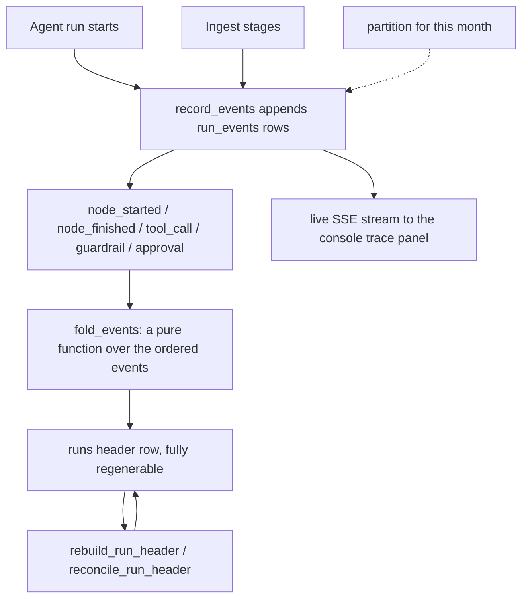

# Runs

## What it is

The durable record of one run, from the first token to the last: every stage
it entered, every guardrail verdict, every tool call, every token and every
dollar. Events are appended as they happen; the summary header is **derived**
from them afterwards.

An **append-only event log** means nothing edits a row in place. A crash
mid-run leaves a valid partial history rather than a half-written summary, and
a change to the summarising logic can be applied retroactively by re-folding
the same events.

## Why it exists

Two operational needs. A run's status must be reconstructible even if the
code that summarises it changes later. And a run's cost, timing and approval
count must be answerable months afterwards, for governance and for
troubleshooting, without trusting a mutable status column that some writer may
have skipped.

## Diagram

## How it works

1. As a run progresses, `record_events()` appends `RunEvent` rows inside the
   transaction that did the work.
2. Ordering is by `seq`, the orchestrator's monotonic per-run counter — not by
   `ts`, which is a wall clock and can tie or go backwards.
3. `run_events` is `PARTITIONED BY RANGE (ts)`. A partitioned table with no
   matching partition rejects every insert, so `partitions.py` creates monthly
   partitions ahead of time through an `after_create` hook, and installs the
   same tenant policy on each new partition that the parent carries.
4. `fold_events()` derives the header purely from the ordered event sequence.
   Every column on `runs` is a fold; nothing writes a header field it did not
   first write as an event.
5. `rebuild_run_header` and `reconcile_run_header` recompute a header from
   scratch, which is what makes "events win" testable rather than a slogan.
6. `event_type` is stored as `text`, not a Postgres enum. An event type the
   record layer does not recognise is exactly the one an operator needs to
   see, so it is stored and shown rather than rejected.
7. **Cost is metered at the gateway**, which every model call passes through
   by construction, so a run's `cost_usd` includes guardrail calls, the depth
   classifier and the grounding check — not only what a graph node returned.
   The figures reconcile against `usage_ledger`.
8. Ingest reuses the same substrate: `app.jobs.ingest_log` writes
   `ingest_stage` and `ingest_finished` transitions as `run_events` rows, so a
   document's ingest progress and a conversational run share one mechanism and
   one partition scheme.
9. `duration_ms` is the sum of the `node_finished` durations, not wall-clock
   `finished_at - started_at`. The two differ whenever a run parks at a human
   approval gate, and the node sum is the one that means "work done".

## What it stores

**`run_events`** — one row per event, primary key `(id, ts)` because Postgres
requires the partition key in every unique constraint on a partitioned table.

| Column | What it is for |
| --- | --- |
| `id`, `ts` | composite key; `ts` also routes the row to its monthly partition |
| `run_id` | the run this event belongs to |
| `tenant_id` | FK to `tenants`, nullable for a platform-level run |
| `seq` | the monotonic per-run counter every replay orders by |
| `event_type` | free text, e.g. `node_started`, `tool_call`, `guardrail` |
| `agent_id` | which lane emitted it, for a per-agent view |
| `job_id` | FK to `job_runs` when a durable job triggered the run |
| `trace_id`, `span_id` | the OpenTelemetry correlation ids |
| `payload` | JSONB, the event body as it streamed |

Indexes: `ix_run_events_run_seq`, `ix_run_events_run_agent`,
`ix_run_events_tenant_ts`, `ix_run_events_trace`.

**`runs`** — the regenerable header, keyed by `run_id`.

| Column | What it is for |
| --- | --- |
| `tenant_id`, `user_id`, `agent_id`, `trace_id` | ownership and correlation |
| `status` | nullable with **no default**; `NULL` means the run has not reached a terminal state |
| `started_at`, `finished_at`, `duration_ms` | timing |
| `prompt_tokens`, `completion_tokens`, `cost_usd` | attribution figures reconciled against `usage_ledger` |
| `cache_hit` | whether the answer cache served this run |
| `event_count`, `last_seq` | fold bookkeeping |
| `node_count`, `tool_call_count`, `approval_count`, `guardrail_block_count` | the counted facts a console shows |
| `error_message` | the terminal failure, when there was one |

## Security and tenant isolation

- Both tables carry `tenant_id` and are registered for Postgres row-level
  security. Monthly partitions are not registered by name — their names are a
  function of the calendar — so `partitions.py` installs the identical policy
  on each partition as it creates it.
- `tenant_id` is nullable. Under the isolation predicate `NULL = <scope>` is
  `NULL` rather than true, so a platform-level run is invisible to every
  tenant. That is the intended reading.
- `run_events` is **append-only for the serving role**: it holds `SELECT` and
  `INSERT`, and `UPDATE, DELETE` are revoked. The revoke is expanded through
  `pg_inherits` to every attached partition, because Postgres checks
  privileges on the relation *named* in the query.
- Retention is `prune_run_event_partitions`, which `DROP`s a whole expired
  partition. That is DDL, already owner-only, never a `DELETE`.
- `runs` is deliberately **not** append-only: the header moves through its
  states as the fold advances.

## API surface

There is no `GET /v1/runs` and no `GET /v1/run-events`. The record surfaces
through three purpose-built views:

| Method | Path | Who may call | Returns |
| --- | --- | --- | --- |
| GET | `/v1/documents/{document_id}/ingest` | any authenticated caller | one document's ingest stage timeline, read from `run_events` |
| GET | `/v1/platform/pipeline` | platform staff or platform admin | pipeline health, joining `job_runs` with `run_events` |
| POST | `/v1/query` | any authenticated caller | the live SSE stream of the same events, as they are emitted |

`GET /v1/llmops/runs` is a different surface: which prompt *version* served
each recent run.

## Configuration

This module reads no environment variables of its own. It writes to the
platform database configured by `POSTGRES_DSN`, and partition creation and the
serving-role grants run on `POSTGRES_ADMIN_DSN`. `RLS_FAIL_CLOSED` (default
`false`) decides what an unbound tenant scope sees.

## Where it lives

| Path | What it does |
| --- | --- |
| `aegis/src/aegis/runs/models.py` | `RunEvent` and `Run` table definitions, `RUNS_TABLE`, `RUN_EVENTS_TABLE` |
| `aegis/src/aegis/runs/record.py` | `RunEventRecord`, `record_events()`, `fold_events()`, `read_run_header()`, the rebuild helpers |
| `aegis/src/aegis/runs/partitions.py` | monthly partition creation, policy install, `prune_run_event_partitions` |
| `backend/src/app/agent/run_log.py` | the agent's write side into `run_events` |
| `backend/src/app/jobs/ingest_log.py` | the ingest pipeline's write side into the same table |
| `backend/src/app/api/ingest_log.py` | `GET /v1/documents/{id}/ingest` reads the log back |
| `backend/src/app/api/routes_health.py` | `GET /v1/platform/pipeline` aggregates `job_runs` and `run_events` |
| `aegis/src/aegis/governance/rls.py` | the append-only revoke and the partition expansion |

## What it does not do

- No generic REST endpoint for the raw event log. Every consumer goes through
  a purpose-built aggregation or the live stream.
- The header is not the source of truth. It is a projection, and it can lag a
  very recent event until the next fold runs.
- Nothing deletes individual events. Retention drops whole partitions.
- The event vocabulary is not constrained by the database. Validation of an
  event's shape happens at the streaming layer, not in the schema.
