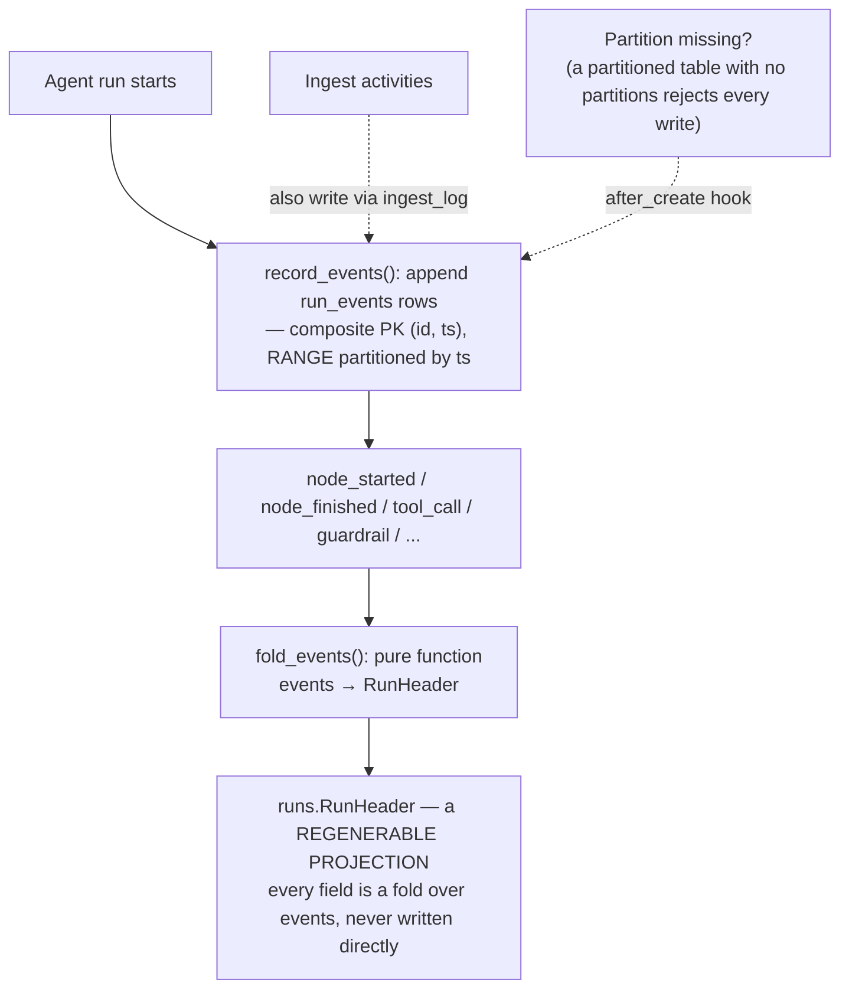

# Runs

## What it is

The durable record of one agent run, from the first token to the last —
every stage it entered, every guardrail verdict, every tool call, every
cost. If you have never worked with an append-only event log before: instead
of a single `runs` row being written and then edited in place as a run
progresses (which loses the history of what happened, and can leave a
half-updated row if the process crashes mid-write), Aegis appends immutable
`run_events` rows as things happen, and the summary header is **derived**
from them afterward, never written directly.

## Why it exists here

Two properties this buys, both real operational needs: a run's status is
always reconstructible even if the summarising code changes later (just
re-fold the same events with new logic), and a crash mid-run cannot corrupt
the record into an inconsistent state — a partial set of events is still a
valid, readable partial history, never a half-written row.

## Diagram



## The architecture

```
aegis/src/aegis/runs/
  models.py       RunEvent (partitioned table) and Run (the header) table definitions
  record.py       RunEventRecord, fold_events(), record_events(), read_run_header()
  partitions.py   monthly range-partition creation and pruning
backend/src/app/jobs/ingest_log.py    writes ingest stage transitions as run_events
backend/src/app/api/ingest_log.py     GET /v1/documents/{id}/ingest — reads the log back
backend/src/app/api/routes_health.py  GET /v1/platform/pipeline — aggregates job_runs + run_events
```

## What is actually in Aegis

### `run_events` — range-partitioned by time, on purpose

```python
__tablename__ = "run_events"
# composite PK (id, ts)
# postgresql_partition_by: "RANGE (ts)"
```

A **partitioned table with no partitions rejects every write** — Postgres
requires at least one matching partition to exist before an insert can
land. `partitions.py` creates monthly partitions ahead of time via an
`after_create` hook, and `prune_run_event_partitions` can drop old ones. The
partitioning exists so a growing event log does not turn into one
enormous, ever-slower table — old months can be pruned or archived as
whole partitions rather than deleted row by row.

### `Run` — a regenerable projection, never written directly

`runs.models.Run` (the header table) has columns like `status`,
`started_at`, `finished_at`, `prompt_tokens`, `completion_tokens`,
`cost_usd` — every one of them a **fold over the events**, computed by
`fold_events()`, never set by application code writing to the header
table directly. This is worth understanding precisely: if the folding logic
has a bug and is fixed later, `rebuild_run_header`/`reconcile_run_header`
can regenerate every historical header correctly from the same immutable
event rows, because the events were never lossy in the first place.

### Cost is metered at the gateway, not folded from what a node returned

`cost_usd` on the header is still a fold over events, but **which** events carry
usage changed on 2026-08-23, and the old answer was wrong in two ways at once.
Cost used to be read from LangGraph's reducers, which see only what a node
*returns* — so guardrail calls, the depth classifier and the grounding check were
all invisible — and a terminal `BLOCKED` or `ERROR` event passed no usage at all,
so a refused run reported **$0.0000** against a real $0.036 of spend.

Usage is now recorded at the gateway's own metering chokepoint, which every model
call passes through by construction, and the reported figures match the
`usage_ledger` exactly. The general lesson is worth carrying: a total assembled
from what the *orchestrator* observed will always miss the calls the orchestrator
did not make itself.

### `run_events` cannot be rewritten by the serving role

Since 2026-08-23 the connection every request arrives on holds `SELECT, INSERT`
on `run_events` and nothing more — and the revoke is expanded through
`pg_inherits` to each monthly partition, because Postgres checks privileges on
the relation *named* and `DELETE FROM run_events_2026_08` would otherwise still
have worked. Retention is still possible because it is
`prune_run_event_partitions` dropping a whole expired partition — DDL, already
owner-only — never a `DELETE`. See `governance.md`.

### Ingest logging reuses the same substrate

`backend/src/app/jobs/ingest_log.py` writes document-ingest stage
transitions (`ingest_stage`, `ingest_finished`) as `run_events` rows too —
it is not a separate logging system. This is why a document's ingest
progress and an agent's conversational run share one underlying mechanism
and one partition scheme.

### No REST endpoint for runs directly

There is no `GET /v1/runs` or `GET /v1/run-events`. (`GET /v1/llmops/runs` is a
different thing: which prompt *version* served each recent run.) The record surfaces only
through three purpose-built views: the per-document ingest progress
endpoint, the platform pipeline health aggregation (which joins `job_runs`
with `run_events`), and the live SSE stream a conversational run emits in
real time as it happens — the trace panel in the console consumes the live
stream directly, not a REST poll of stored events.

## How it runs

1. As an agent run or an ingest job progresses, each meaningful step —
   node started, node finished, a tool call, a guardrail verdict — is
   appended as an immutable `RunEvent` row via `record_events()`.
2. The events accumulate under the run's id, partitioned by the timestamp
   column.
3. `fold_events()` derives the summary header (status, timing, token counts,
   cost) purely from the event sequence — this can be re-run at any time to
   regenerate the header from scratch.
4. Live consumers (the console's trace panel) read the same events as they
   are emitted, over SSE, rather than polling the stored table.

## What is not here

- **No direct REST surface for the raw event log** — every consumer goes
  through a purpose-built aggregation (ingest progress, pipeline health) or
  the live stream, never a generic "give me the events for run X" endpoint.
- **The header table is not the source of truth** — treat it as a cache of
  the fold; the events are the actual record. Code that needs to be
  certain of a run's state should be aware the header could in principle be
  stale relative to a very recent event, until the next fold runs.
