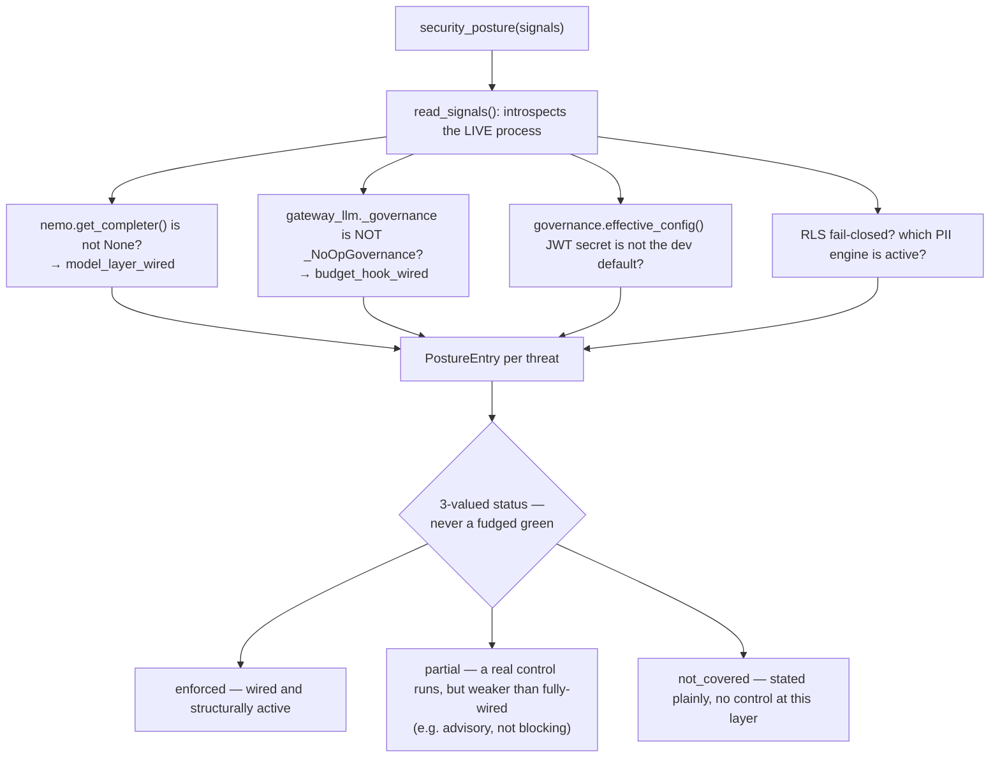

# Security posture

## What it is

A live, introspective report of which security controls are **actually
wired and active right now** in the running process — not a static document
claiming what the architecture is supposed to do. If you have never seen
this distinction matter: most security documentation describes intent
("we use RLS for tenant isolation"), which can silently go stale the moment
a deployment misconfigures something, with no mechanism to notice. This
module instead **imports the real symbols it is reporting on** and checks
their actual state at read time.

## Why it exists here

A claim like "prompt injection is blocked" is only true if the model
classifier actually has a completer wired, or the deterministic backstop is
running. A deployment that forgot to wire the model layer would have that
claim silently become false with no visible signal, if the claim were
static prose. This module reports the **real, live wiring**, so a status
flips the moment the process is reconfigured — it cannot lag behind reality
the way a document can.

## Diagram



## The architecture

```
aegis/src/aegis/security/
  posture.py   PostureEntry, PostureSignals, read_signals(), security_posture()
```

Deliberately one small file, and deliberately dependency-light: it imports
only the modules it introspects (pydantic and stdlib), never litellm,
redis, or a database driver — reading the posture never spends money and
never needs a live connection to anything, so it can be checked cheaply and
often.

## What is actually in Aegis

### Real symbols, not fabricated claims — checkable by a test

Every `PostureEntry` names an actual, importable module and function —
quoted: *"a test can prove the control it claims actually exists — no
fabricated `enforced`."* Concretely, the signals this module reads:

- **Is the model-based injection classifier wired?** —
  `aegis.guardrails.nemo.get_completer() is not None`. If no completer was
  ever set, this is `False`, meaning only the free deterministic signature
  layer is protecting the input path.
- **Is a real budget-governance hook injected at the gateway?** —
  `not isinstance(gateway_llm._governance, gateway_llm._NoOpGovernance)`.
  A misconfigured deployment running with the no-op governance hook would
  show this as `False` — meaning the gateway is effectively ungoverned.
- **Is a strong JWT signing secret in force**, versus the documented
  development default? Read from `aegis.governance.effective_config()`.
- **Is Postgres RLS running fail-closed**, and which PII engine (Presidio
  or regex fallback) is actually active — both read live, not assumed.

### Three statuses, deliberately, never two

```python
class PostureStatus(StrEnum):
    enforced     # wired and structurally active right now
    partial      # a real control runs, but a layer is off/advisory/host-side
    not_covered  # no control at this layer — stated plainly, never hidden
```

The explicit reasoning, quoted: this vocabulary exists *"so the surface can
never fudge a green: a real but weakened control is `partial` (not
`enforced`), and an absent control is `not_covered`, not silently omitted
from the report."* A topical rail running in its default advisory mode
(see `guardrails.md`) would correctly report as `partial`, not `enforced`
— it is a real, running control, just not a blocking one.

### The distinction from `aegis.platform`'s risk map

The module docstring is explicit about a sibling surface this is *not*:
`aegis.platform`'s risk map carries stable engineering **judgement**
(likelihood/impact bands — a human-authored assessment of how bad a threat
class is). This module reports **live control status** instead — whether
the mitigation for that threat is actually switched on right now. The two
answer different questions and are not meant to be confused: one is "how
bad would this be", the other is "is the thing that prevents it currently
running."

## How it runs

1. `security_posture()` calls `read_signals()`, which imports and
   introspects the real modules — the guardrail completer, the gateway's
   governance hook, the JWT config, the RLS mode, the PII engine.
2. Each signal is mapped to a `PostureEntry` for its corresponding threat
   (OWASP LLM Top-10 2025 plus key agentic-specific threats).
3. The whole call is side-effect free and deterministic given the current
   process state — calling it twice in a row with nothing reconfigured
   returns the identical report.

## What is not here

- **No historical tracking.** This is a snapshot of the current process's
  wiring, not a log of how the posture has changed over time.
- **No automated remediation.** The module reports what is wired; it does
  not wire anything itself or alert on a `partial`/`not_covered` finding —
  that is left to whatever consumes the report (a dashboard, an operator).
- **It cannot detect a control that is wired but broken in a way that does
  not change the introspected symbol's state** — e.g. a completer that is
  set but silently failing every call would still read `model_layer_wired:
  True`, because the check is "is something wired," not "is it working
  correctly on every call."
