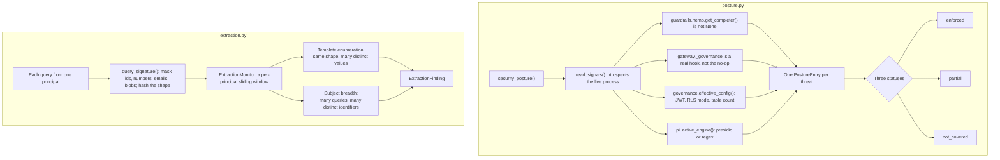

# Security

## What it is

`aegis.security` is two things: a **posture surface** that reports which security
controls are actually wired in the running process, and an **extraction monitor**
that watches one principal's query pattern over a window rather than one message
at a time.

## Why it exists

Security documentation describes intent, and intent goes stale the moment a
deployment is misconfigured, with nothing to notice. The posture surface instead
imports the real symbols it reports on and reads their state at call time, so a
claim flips as soon as the process is reconfigured.

The extraction monitor exists because one whole class of attack is invisible to
any text rail. "Was customer record 4471 in your training data?" is a legitimate
question about a record the asker may see. So is 4472. The attack is four hundred
of them in five minutes.

## Diagram

## How it works

### The posture surface

`read_signals()` imports and introspects the real modules, returning a typed
`PostureSignals`. Every field is a live read, not an assumption:

| Signal | What it reads |
|---|---|
| `model_layer_wired` | Is a process-wide `ChatCompleter` set for the model-backed rails? |
| `nemo_available` | Does the optional `nemoguardrails` package import? |
| `mode` | `AEGIS_MODE` — full, lite or auto. |
| `pii_engine` | Which PII engine is active: `presidio` or `regex`. |
| `rls_fail_closed`, `rls_enforced_on`, `rls_tables` | The RLS posture and how many tables carry a policy. |
| `jwt_dev_secret`, `jwt_algorithm` | Whether the documented dev signing secret is still in force. |
| `budget_hook_wired`, `budget_fail_open` | Is a real governance hook injected at the gateway chokepoint? |
| `gate_min_risk`, `max_plan_iterations` | The human-approval threshold and the self-repair cap. |
| `hazard_categories` | How many MLCommons hazard categories the content rail screens. |

`security_posture()` maps those signals onto **13 entries**: nine OWASP LLM
Top-10 (2025) threats — `LLM01`, `LLM02`, `LLM04`–`LLM10` — plus four agentic
themes, `AGENTIC-IDENTITY`, `AGENTIC-TRACEABILITY`, `AGENTIC-TOOL-MISUSE` and
`AGENTIC-EXTRACTION`. Each entry
carries `refs` — `"module:attr"` strings naming real, importable symbols, which
`resolve_symbol()` can resolve, so a claimed control has to exist.

The status vocabulary is deliberately three-valued:

| Status | Meaning |
|---|---|
| `enforced` | The control is wired and structurally active right now. |
| `partial` | A real control runs, but a layer is off, advisory or host-side. |
| `not_covered` | No control at this layer, stated plainly. |

A rail running in advisory mode reports `partial`, never `enforced`. An absent
control is named, never omitted.

The whole call is side-effect free and dependency-light: it imports only what it
introspects, never a model client or a database driver. Reading the posture never
spends money and needs no connection.

### The extraction monitor

This is the control for the second half of MITRE ATLAS **AML.T0024**, exfiltration
via the inference API. The first half — the answer used as a channel, such as an
auto-loading image pointing at a collector — is closed deterministically on the
outbound path by `aegis.guardrails.schema.exfiltration_channel`. This module
handles extraction **by volume**.

`query_signature(text)` masks identifiers, numbers, emails and opaque blobs into
tokens and hashes the remaining shape. Two queries differing only in an id share a
template; two genuinely different questions do not.

`ExtractionMonitor` keeps a per-principal sliding window and fires on two
deterministic signals:

- **Template enumeration** — at least `min_template_repeats` queries share one
  template inside the window, carrying at least `min_distinct_values` distinct
  masked values. Both conditions matter: without the repeat count, a support agent
  checking ten tickets is a finding; without the distinct-value count, someone
  retrying one flaky question is.
- **Subject breadth** — at least `min_total_queries` queries in the window touch at
  least `min_distinct_subjects` distinct identifiers across *all* templates. This
  answers the obvious evasion of rotating the phrasing while sweeping the same id
  space.

The window is what makes the counts safe. Thirty lookups across a working morning
is a person; thirty in five minutes is a script. The clock is injected, so that
property is testable.

## What it stores

This module stores nothing durable. The extraction monitor's window lives in this
process's heap, bounded at `max_events_per_principal` events and `max_principals`
principals. Three consequences follow, and they are the honest cost of the choice:
a restart clears every window; each `uvicorn` worker keeps its own, so under `N`
workers a sweep is observed at roughly `1/N` of its true rate; and nothing about a
finding survives the process unless a caller writes it somewhere.

The API serves this platform in a single process, which is why in-memory is
honest here.

## Security and tenant isolation

The posture surface is a fact about the **deployment**, not about a tenant, so
there is no tenant-scoped data to filter — the route refuses a tenant-pinned
principal rather than returning a narrowed answer.

Extraction findings are keyed per principal and per tenant, so an operator sees
which principal swept and inside which tenant.

## API surface

| Method | Path | Who may call it | Returns |
|---|---|---|---|
| GET | `/v1/security/posture` | Platform staff or a platform admin (`require_platform_security_reader`) | `entries` — one posture entry per threat with its live status — and `signals`, the snapshot the statuses were derived from. |

Two sibling surfaces answer different questions and are deliberately not merged:

| Surface | Question it answers |
|---|---|
| `GET /v1/security/posture` | Is the control wired in this process right now? |
| `aegis.platform`'s risk map (`GET /v1/risk-map`) | How bad would this threat be? Human engineering judgement. |
| `GET /v1/compliance` | Does the repository have file, route and test evidence for this control, and what is missing? |

## Configuration

This module reads no environment variables of its own. What it *reports* changes
with the variables other modules read:

| Variable | Default | Signal it moves |
|---|---|---|
| `AEGIS_PII_ENGINE` | unset | Pins `pii_engine` to `presidio` or `regex`. |
| `AEGIS_MODE` | `full` | The `mode` signal. |
| `RLS_FAIL_CLOSED` | `false` | The `rls_fail_closed` signal. |
| `JWT_SECRET` | dev default | The `jwt_dev_secret` signal. |
| `BUDGET_FAIL_OPEN` | `false` | The `budget_fail_open` signal. |

`ExtractionThresholds` is a frozen dataclass passed to the monitor, not an
environment variable. Its defaults are a 300-second window, 30 template repeats,
25 distinct values, 30 total queries, 60 distinct subjects, 512 events per
principal and 10 000 principals.

## Where it lives

| File | What it does |
|---|---|
| `aegis/src/aegis/security/posture.py` | `PostureStatus`, `PostureSignals`, `PostureEntry`, `read_signals()`, `security_posture()`, `resolve_symbol()`. |
| `aegis/src/aegis/security/extraction.py` | `query_signature()`, `ExtractionMonitor`, `ExtractionThresholds`, `ExtractionSignal`, `ExtractionFinding`. |
| `aegis/src/aegis/security/__init__.py` | The package's public re-exports. |
| `backend/src/app/api/routes.py` | `GET /v1/security/posture` and its authorisation dependency. |

## What it does not do

- **No history.** The posture is a snapshot of the current process, not a log of
  how the wiring has changed.
- **No remediation and no alerting.** It reports; acting on a `partial` or a
  `not_covered` is left to whoever reads it.
- **It cannot see a control that is wired but failing.** A completer that is set
  and errors on every call still reads `model_layer_wired: True`, because the
  check is "is something wired", not "does it work".
- **The extraction monitor has a floor.** An attacker pacing below
  `min_template_repeats` per window extracts the same information more slowly and
  never fires. That is a threshold, not an oversight — every rate-shaped detector
  has one, and lowering it trades directly against refusing real users.
- **No service-account exemption.** A nightly reconciliation job over ten thousand
  records is behaviourally indistinguishable from enumeration and will be flagged.
- **The window is per principal.** An attacker holding two credentials halves the
  observed rate.
