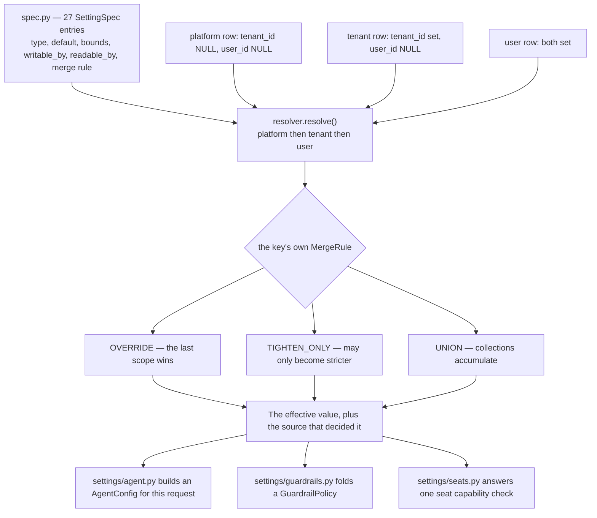

# Settings

## What it is

`aegis.settings` is the one place every tenant-overridable control in Aegis is
declared, stored, resolved and written. It holds a catalogue of setting
specifications, one table of written values at three scopes, and a resolver that
merges them under each setting's own rule.

## Why it exists

The hard problem in multi-tenant configuration is not storing a value per tenant.
It is deciding what happens when the platform sets one thing and a tenant sets
another for the same key. Without a single resolver, every module reading a
tenant-configurable value reimplements "check user, then tenant, then platform" —
and each reimplementation is a chance to let a tenant weaken a control the
platform meant as a floor.

This module turns "a tenant may add a guardrail but never weaken one" from a
convention someone has to remember into arithmetic the resolver performs.

## Diagram

## How it works

### Every setting is declared once

`spec.py` holds `SETTING_SPECS` — **27 keys**, each a `SettingSpec` carrying its
type, default, bounds, the roles that may read it, the roles that may write it,
and its merge rule. A new control is a catalogue entry plus a row, never a new
table and never a migration.

The keys group into six families: `agent.*` (8 — gate threshold, plan iterations,
the two trajectory token ceilings, retrieval rounds, parallelism, model, mode),
`guardrails.*` (7 — topical and grounding blocking, denylist terms and patterns,
PII entities and blocking, input ceiling), `jobs.*` (3 — in-flight caps and cost
estimates), `memory.*` (2 — retention windows), `seat.*` (the six per-user
capabilities), and `skills.enabled`.

Two of the `agent.*` keys are the agent loop's token ceilings —
`agent.max_trajectory_tokens` (36 000) and `agent.max_tool_result_tokens`
(4 000). Both are `TIGHTEN_ONLY`, so a tenant may shrink either and never widen
one, and both are enforced on the main graph *and* on every sub-agent lane. This
is the catalogue seam that makes a per-tenant ceiling a row rather than a deploy.

### Three merge rules

| Rule | Count | Behaviour | Example |
|---|---|---|---|
| `TIGHTEN_ONLY` | 18 | The value may only become stricter than the enclosing scope. | `agent.gate_min_risk`, `agent.max_trajectory_tokens`, `guardrails.pii.block` |
| `OVERRIDE` | 5 | The last scope wins outright. | `agent.model`, `memory.retention_days` |
| `UNION` | 4 | Collections accumulate; nothing can be removed. | `guardrails.denylist.terms`, `skills.enabled` |

`TIGHTEN_ONLY` is the load-bearing one. The resolver structurally cannot compute a
value weaker than the platform default, so a tenant admin writing a guardrail key
can only turn an advisory rail into a blocking one, never the reverse.

Which direction counts as "stricter" is a property of what a setting *means*, not
of its type, so each `TIGHTEN_ONLY` spec declares a `Strictness`: a lower
`agent.gate_min_risk` gates **more** actions, so lower is stricter; a higher
grounding score demands **more** evidence, so higher is.

### Resolution and writing

`resolve(key, ...)` answers two things at once: what is in force, and **who
decided it**. The second half is not decoration — a screen showing a value without
saying whether it is the platform's floor or the tenant's own choice cannot be
audited. `resolve_all()` does the whole catalogue in one query rather than N round
trips.

`write_setting()` is the only writer, and it owns every refusal:

| Error | When |
|---|---|
| `SettingNotWritableError` | The caller's role is not in the key's `writable_by`. |
| `SettingNotReadableError` | The caller's role is not in `readable_by`. |
| `SettingValueError` | Wrong type, or out of the declared bounds. |
| `SettingWeakerThanFloorError` | A `TIGHTEN_ONLY` write weaker than the enclosing scope. |

The HTTP route re-checks none of this. A second policy that can disagree with the
first is worse than no second policy.

### Per-request folding

Three thin modules turn resolved values into the objects other packages consume,
and all three build a **new** object per request rather than writing onto a
process-wide singleton:

- `agent.py::resolve_agent_config()` — an `AgentConfig` for this tenant.
- `guardrails.py::resolve_guardrail_policy()` — a `GuardrailPolicy` folded onto the
  host's floor, then handed to `Guardrails.with_policy()`.
- `seats.py::seat_allows()` / `seat_of()` — one user's seat.

Each also exposes a `strictest_*` helper, so a caller can compute the tightest
legal shape without a database.

### Seats

A **seat** is a per-user capability, finer than the five roles. `SEAT_CAPABILITIES`
is a closed set of six toggles, each declared beside the guard that reads it:

| Key | Gates |
|---|---|
| `seat.can_upload_documents` | `POST /v1/documents`, `POST /v1/jobs/{job_id}/requeue` |
| `seat.can_edit_memory` | `POST /v1/memory/forget`, `DELETE /v1/memory/facts/{fact_id}` |
| `seat.can_approve` | `POST /v1/approval`, `POST /v1/approvals/{approval_id}/decision` |
| `seat.can_view_tenant_audit` | `GET /v1/audit` |
| `seat.can_change_agent_mode` | `PUT /v1/settings/{key}`, for every `agent.*` key |
| `seat.label` | Descriptive only — an `OVERRIDE` string that names the grant |

`gates` is prose, not a callable, because enforcement lives in the host's HTTP
layer and `aegis` must not import a host. Naming it is what stops a toggle being
added with no reader.

## What it stores

One table, `settings`, on the shared `AegisBase` metadata. Rows are **writes**, not
effective values — what is in force is computed by the resolver.

| Column | Purpose |
|---|---|
| `id` | Primary key. |
| `scope` | `platform`, `tenant` or `user`. Stored rather than inferred, because it is what `resolve` returns as `source`, what a control renders as its badge, and what an audit row records. |
| `tenant_id` | FK to `tenants.id`. NULL marks the platform baseline. |
| `user_id` | FK to `users.id`. Set only on a user row. |
| `key` | The catalogue key. |
| `value` | `jsonb` holding any JSON value — a number and a list are as common as an object, so scalars are not wrapped. |
| `updated_at` | When it was last written. |
| `updated_by` | A string, not a `users.id`, matching `audit_log`: the writer may be a platform operator with no row in this database. |

Two check constraints keep the scope column and the id columns in agreement:
`(scope = 'platform') = (tenant_id IS NULL)` and
`(scope = 'user') = (user_id IS NOT NULL)`. A user- or tenant-scoped row with a
NULL tenant would be world-readable, because NULL is exactly what marks the
platform baseline.

Uniqueness is **three partial unique indexes**, one per scope, rather than one
composite `UNIQUE`. SQL treats NULL as distinct from NULL, so a composite
constraint would admit two platform rows for the same key; `NULLS NOT DISTINCT` is
PostgreSQL 15 and the target cluster is 14.

There is deliberately no `created_at`. The row is the current value at a scope;
its history is the audit log's job.

## Security and tenant isolation

- `settings` is registered in `_TENANT_SCOPED_TABLES`, so the `tenant_isolation`
  policy is installed on it at boot.
- It is also one of the two `_PLATFORM_BASELINE_TABLES`. Every tenant can **read**
  the platform rows and no tenant can write them. That readability is required:
  a resolver that could not see the platform layer would compute a value weaker
  than the platform's own choice for a `TIGHTEN_ONLY` key while looking healthy.
- Read and write authority are per key, declared on the spec and enforced by the
  resolver. `jobs.*` keys, for instance, are writable by `platform_admin` only and
  are not readable by a `client` at all.
- Keys a caller may not read are **omitted** from the list response rather than
  refused, so one unreadable key does not blank a settings screen.
- No key gives a tenant reach into SQL: no catalogue key contains `sql`,
  `database.`, `db.query` or `schema.browse`.

## API surface

| Method | Path | Who may call it | Returns |
|---|---|---|---|
| GET | `/v1/settings` | Any authenticated caller | Every control this caller may read, resolved, each with its source. |
| GET | `/v1/settings/{key}` | Any authenticated caller | One control's effective value and the scope that decided it. 404 for an unknown key, 403 when unreadable, 503 when the store is unreadable. |
| PUT | `/v1/settings/{key}` | Any authenticated caller, subject to the key's `writable_by` | The written row, re-resolved. Every refusal is the resolver's. |
| GET | `/v1/admin/seats` | `tenant_admin` and above | The tenant's seats. |
| PUT | `/v1/admin/seats/{user_id}` | `tenant_admin` and above | One user's updated seat. |

## Configuration

This module reads no environment variables — its whole point is that controls live
in the database rather than the environment. Two host variables affect it:

| Variable | Default | Effect |
|---|---|---|
| `STORES` | `on` | With `off` there is no `settings` table, so the catalogue's compiled-in defaults genuinely are what is in force and are reported with `source="platform"`. |
| `POSTGRES_DSN` | local default | Where the `settings` table lives. |

## Where it lives

| File | What it does |
|---|---|
| `aegis/src/aegis/settings/spec.py` | `SETTING_SPECS`, `SettingSpec`, `MergeRule`, `Strictness`, `spec_for`, `strictest`. |
| `aegis/src/aegis/settings/models.py` | The `settings` ORM table, `SettingScope`, the constraints and indexes. |
| `aegis/src/aegis/settings/resolver.py` | `resolve`, `resolve_all`, `write_setting`, and the four refusal errors. |
| `aegis/src/aegis/settings/agent.py` | `resolve_agent_config`, `strictest_agent_config`. |
| `aegis/src/aegis/settings/guardrails.py` | `resolve_guardrail_policy`, `fold_resolved`, `strictest_guardrail_policy`. |
| `aegis/src/aegis/settings/seats.py` | `SEAT_CAPABILITIES`, `Seat`, `seat_allows`, `seat_of`. |
| `backend/src/app/api/routes_console.py` | The three `/v1/settings` routes. |
| `backend/src/app/api/routes_seats.py` | The two `/v1/admin/seats` routes. |

## What it does not do

- **`OVERRIDE` keys offer no floor.** That is deliberate for keys such as
  `agent.model`, where there is no safety reason to stop a tenant replacing the
  platform default. Which rule a new key gets is a per-key decision.
- **No history of values.** The row is the current value; the audit log records the
  change.
- **No caching across requests.** A resolved value is used for one request and
  discarded, never held as a shared mutable object.
- **No key reaches SQL, a model name for the classifier, or a deployment.** The
  catalogue is bounded by design, and a control outside it is deployment
  configuration rather than a tenant-writable setting.
- **The resolver enforces authority; it does not authenticate.** Identity and role
  come from `aegis.governance`.
