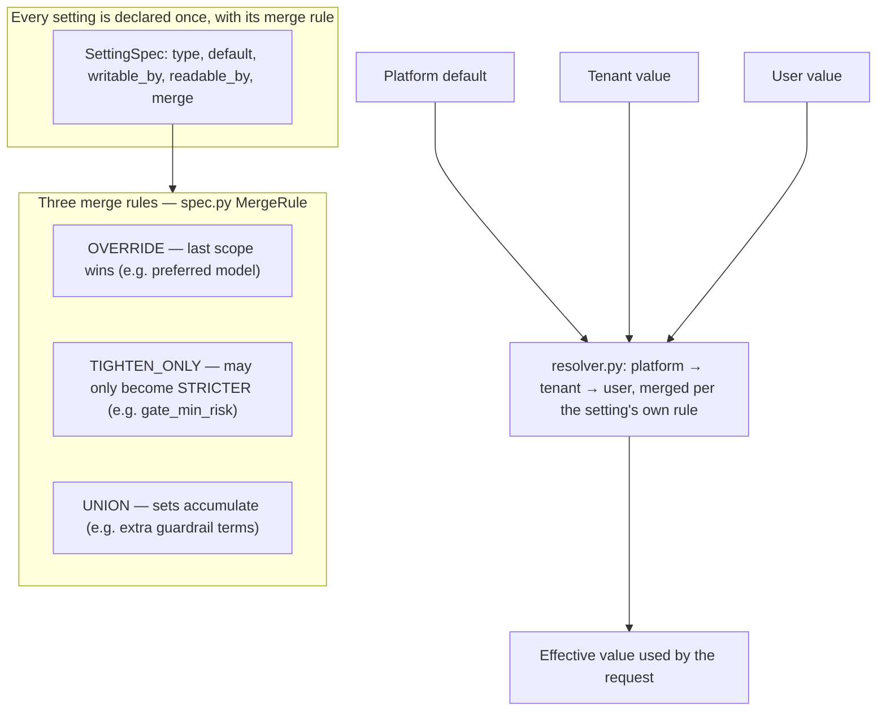

# Settings

## What it is

The one place every tenant-overridable configuration value in Aegis is
declared, resolved, and merged — guardrail thresholds, model preferences,
seat permissions, prompt versions, which skills are enabled. If you have
never built multi-tenant configuration before: the hard problem is not
storing a value per tenant, it is deciding **what happens when the platform
sets one thing and a tenant sets another** for the same key. Aegis answers
that with three explicit merge rules rather than leaving it to each call
site's own judgement.

## Why it exists here

Without a single resolver, every module that reads a tenant-configurable
value would have to independently reimplement "check user override, then
tenant override, then platform default" — and each reimplementation is a
chance to get the security-relevant cases wrong (a tenant weakening a
guardrail the platform intended to be a floor). Centralising the merge logic
turns "a tenant may add a rule but never remove a platform one" from a
convention someone has to remember into arithmetic the resolver enforces
for every setting that declares it.

## Diagram



## The architecture

```
aegis/src/aegis/settings/
  spec.py        every SettingSpec, MergeRule, Strictness — the declaration layer
  resolver.py     platform→tenant→user resolution + write authority checks
  guardrails.py   resolve_guardrail_policy() — folds settings onto a Guardrails pipeline
  seats.py        SeatCapability / Seat — per-user permission checks (seat.can_upload_documents, etc.)
  agent.py        per-request agent config resolution (never a shared singleton — see below)
backend/src/app/ops/prompt_runs.py   the LLM-Ops prompt version ledger (see below)
```

## What is actually in Aegis

### Three merge rules, and why `TIGHTEN_ONLY` is the load-bearing one

```python
class MergeRule(StrEnum):
    OVERRIDE = "override"      # last scope wins (e.g. preferred model)
    TIGHTEN_ONLY = "tighten_only"  # may only become stricter (e.g. gate_min_risk)
    UNION = "union"             # sets accumulate (e.g. extra guardrails)
```

Quoted directly on why `TIGHTEN_ONLY` matters: *"it makes the tenant-safety
rules **executable configuration** rather than prose, because the resolver
structurally cannot compute a value weaker than the platform default."*
This is the exact same mechanism `guardrails.md` describes for `pii_block`
and `topical_block`, and `skills.md` describes for `skills.enabled`
(`UNION`, so no tenant can remove a platform safety skill). Settings is
where that mechanism is actually defined; the other modules just consume
it.

### `Seat` — per-user capability checks, not just per-role

`seats.py` defines `SeatCapability` and `Seat` — a finer grain than the
five coarse roles (`platform_admin`/`tenant_admin`/`ai_team`/`devops`/
`client`). `seat_allows()` checks a specific capability (e.g.
`seat.can_upload_documents`) for a specific user, which is how a tenant
admin can grant one particular user document-upload rights without
promoting them to a different role entirely.

### Prompt versioning — the LLM-Ops loop, with real rollback

Persona system prompts (the actual text instructing the model how to
behave, e.g. the `operations_lead` persona used in this deployment) are
versioned rows, not a single mutable string. `POST /v1/llmops/prompts/versions`
creates a new version; `POST /v1/llmops/prompts/versions/{id}/activate`
switches which version is live. The previous active version becomes
`ARCHIVED`, not deleted — rolling back is one more `activate` call against
the old version's id, not a manual re-paste of old text. This was exercised
live in this project: the platform's own persona prompt originally said "Be
concise and decisive," which was clipping every answer regardless of the
question's actual complexity; the fix was published as version 2 through
this exact mechanism, with version 1 archived and rollback available with
one call, rather than editing the row in place.

### Agent config is resolved per request, never cached as a shared object

`settings/agent.py` resolves a tenant's agent configuration fresh for each
request rather than building one shared, mutable config object reused
across tenants — the same class of bug this design avoids elsewhere (see
`guardrails.md`'s `with_policy()`, which returns a **new** pipeline object
for the same reason): writing one tenant's resolved settings onto a shared
singleton would apply them to the very next tenant's request that happened
to share the process.

## How it runs

1. A module needing a tenant-overridable value (a guardrail threshold, an
   agent's preferred model, whether a skill is in force) calls the
   resolver with the setting's key.
2. The resolver reads the platform default, the tenant's own value (if
   any), and the user's own value (if any), and combines them using
   exactly the merge rule that setting declared — never a generic
   "last write wins."
3. The resolved, effective value is used for that single request and
   discarded, never cached as a shared mutable object across requests.

## What is not here

- **Not every setting is writable by every role** — `writable_by` and
  `readable_by` are declared per setting; a setting a client cannot write is
  refused at the resolver, not merely hidden by a UI that could be bypassed.
- **`OVERRIDE` settings offer no floor protection** — by design, for
  settings like a preferred model where there is no safety reason to
  prevent a tenant from fully replacing the platform default. Choosing
  `OVERRIDE` for a setting that should have been `TIGHTEN_ONLY` would be a
  real security regression, so which rule a new setting gets is a
  deliberate per-setting decision, not a default that's always safe.
