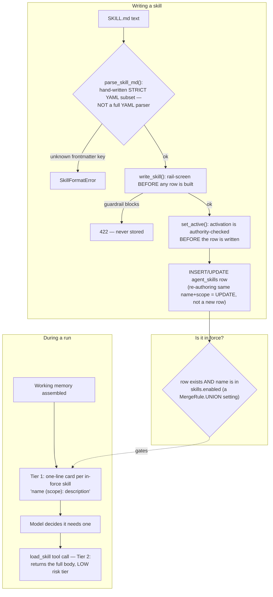

# Skills

## What it is

A skill is a small, named playbook — written in a strict `SKILL.md` format —
that an agent can pull into its own context **on demand**, rather than
having every possible playbook pasted into every prompt. If you have never
seen "progressive disclosure" before: instead of giving the model a 500-page
manual every time, you give it a one-line table of contents ("there is a
skill called `closing_requests` for closing customer requests") and a tool,
`load_skill`, that fetches the full page only when the model decides it
needs it.

## Why it exists here

Without this, an operator wanting to add "when a customer mentions X, do Y"
either has to fork the codebase or accept that every instruction lives
permanently in the system prompt, bloating every single call regardless of
relevance. Skills let a **non-engineer** author a playbook, save it, and have
it reach the right agent — scoped to a platform, a tenant, or one user —
without touching code, and reviewed by the same input guardrail that
screens everything else.

## Diagram



## The architecture

```
aegis/src/aegis/skills/
  document.py   SKILL.md parser + renderer — the strict subset grammar
  models.py     AgentSkill ORM row + the DB CHECK constraints that encode scope rules
  store.py      resolution, authoring, the no-shadow bind order
backend/src/app/agent/skills_tool.py   the load_skill tool definition + dispatch
backend/src/app/api/routes_skills.py   HTTP surface: list/write/activate/delete
```

## What is actually in Aegis

### The `SKILL.md` format — a hand-written strict subset, not a YAML library

Quoted directly from `document.py`'s own reasoning:

> *"The subset here accepts `key: value`, an inline `[a, b]` list and a `-
> item` block list, and refuses everything else by name. A parser that
> cannot express a billion laughs cannot be asked to."*

("Billion laughs" is a real YAML denial-of-service attack using nested
aliases — the point is that a general YAML parser has an attack surface a
three-key grammar simply cannot have.) Accepted frontmatter keys are a
**closed set**: `name`, `description`, `triggers`. Anything else is a
refusal naming the unknown key, not a silently-dropped field. `name` must
match `^[a-z0-9][a-z0-9_-]{1,63}$` — "an identifier in a tool call, not a
title." `description` is capped at 280 characters; the body at 20,000.

The parser was verified against the repo's own root `SKILL.md` (an
unrelated Claude-Code tooling file, not an Aegis skill) — it uses a YAML
folded block scalar the strict parser correctly refuses, which is a live
demonstration that the subset grammar actually excludes what it claims to.

### Two orthogonal facts decide whether a skill is "in force" — deliberately, not one flag

A skill is live only when **both** are true: the row exists in
`agent_skills`, **and** its name appears in the `skills.enabled` setting.
There is deliberately no `enabled` column on the row itself — quoted from
`models.py`: *"A row is content; it is not the answer to 'is this in force'
... There is deliberately no `enabled` column here — a second flag would be
a second mechanism, and the first time the two disagreed the screen and the
prompt would each be reading a different one."*

`skills.enabled` uses `MergeRule.UNION` — the effective in-force set is
platform ∪ tenant ∪ user. This is a **security property**, not a
convenience: a union can only grow, so no tenant or user can ever remove a
platform-authored safety skill from the effective set by writing a shorter
list.

### Scope precedence — the no-shadow rule

Three scopes: `platform`, `tenant`, `user` (reusing the exact same enum as
the settings module, not a second copy that could drift). Which row a *name*
resolves to, when multiple layers declare the same name:

```
a platform row with is_safety=True wins its name outright
otherwise:  user > tenant > platform    (most specific wins)
```

The safety exception is the whole point. Without it, a tenant admin could
author a skill under the exact same name as a platform safety skill and
**replace its content** while the *set* of in-force names stayed identical —
invisible to anything only checking membership. Quoted: *"This function is
the no-shadow rule."* Enforced at the database level too: a `CHECK`
constraint (`ck_agent_skills_only_platform_declares_safety`) makes it
impossible to even insert a non-platform row with `is_safety=True`.

### Triggers order candidates; they never filter

```python
any(term in query.lower() for term in skill.triggers)
```

A trigger match moves a skill to the front of the card list shown to the
model — it never removes an untriggered skill from the list. Quoted
reasoning: *"a trigger that silently withholds a skill is indistinguishable
in the trace from a skill that does not exist."* All in-force skills are
always offered as one-line cards; triggers only affect ordering.

### `load_skill` — why it is a LOW risk tool, deliberately

The tool is registered at `RiskLevel.LOW` — the lowest tier, meaning it
never stops at a human approval gate. The reasoning, quoted: tiering it
higher *"would stop every skill load at a human approval, which is not a
safety property, it is the feature not working."* What actually makes LOW
safe here: the skill's body was already screened by the input guardrail
**at authoring time**, before it was ever stored, and the tool's returned
text passes through the tool-result rail again on the way back into context
— so a malicious body could not have been saved in the first place, and even
a stored body is re-screened on every load.

The tool reads **only** `args["name"]` from the model's call — tenant, user,
and agent identity come from the server-side request context, never from
the model's own arguments. Quoted reasoning: *"the argument comes from a
model that has just read attacker-influenced text, so a `tenant_id` on the
wire here would be a prompt-injectable cross-tenant read."*

### Per-agent assignment — exists in the API, missing from the web client

`AgentSkill.agent_id` is a real column (plain string, no foreign key,
because the roster of agent names belongs to the domain adapter, not to
this module). `SkillWriteRequest.agent`, `SkillRow.agent`, and
`SkillsResponse.agents` all exist in the backend API and are covered by
tests. **The web client does not send or display this field** —
`web/src/lib/api/skills.ts` has no `agent` property, and the drawer UI
currently renders a paragraph asserting the API has no such field, which is
now incorrect. This is a real, verified gap between what the backend
supports and what the console exposes.

## How it runs

1. An author writes or pastes a `SKILL.md`. `POST /v1/skills` parses it with
   the strict grammar, runs the input guardrail over the body **before**
   constructing any database row, then checks the caller's authority to
   write at the requested scope **before** activating it.
2. Every request's working-memory assembly calls `resolve_skills`, which
   computes the platform ∪ tenant ∪ user union, applies the no-shadow bind
   rule per name, sorts triggered-then-safety-then-alphabetical, and returns
   one-line cards.
3. The model sees the cards. If it decides one is relevant, it calls
   `load_skill(name=...)`, which resolves the same way and returns the full
   body — re-screened by the tool-result rail on the way back.

## What is not here

- **Per-agent assignment is a backend-only feature today.** The database and
  API fully support it; the web console does not surface a control for it,
  and its own copy currently claims the opposite.
- **No embedding-based skill selection.** Triggers are plain lowercase
  substring matches, not a vector similarity search — explicitly noted in
  the domain adapter's spec module as "a possible future enhancement; the
  core does not do it today."
- **No versioning, no draft state, no rollback.** Only `created_at`,
  `updated_at`, and `updated_by` — re-authoring the same name at the same
  scope is an in-place `UPDATE`, and there is no history of prior bodies.
- **A filesystem-based skill-selection path exists in the domain adapter
  (`select_skills`, a keyword-to-filename dict) but is explicitly documented
  as no longer on the recall path** — kept alive only because a conformance
  test still checks the shipped starter files are in step with it; nothing
  at runtime calls it.
- **Stale names in the enabled set are silently skipped, by design** — if
  `skills.enabled` names a skill whose row was deleted, resolution simply
  omits it rather than raising, which the source calls "not an error" but
  is worth knowing produces no signal anywhere that the reference is dead.
