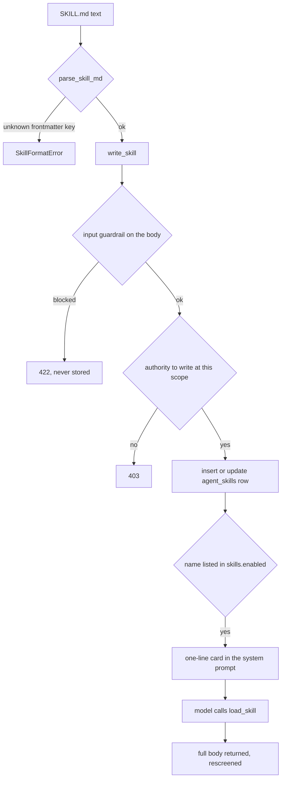

# Skills

## What it is

A skill is a small named playbook, written in a strict `SKILL.md` format,
that an agent pulls into its own context **on demand**. The model always sees
a one-line card for every skill in force; it fetches the full body only by
calling the `load_skill` tool.

That two-tier pattern is **progressive disclosure**: give the model a table of
contents in every prompt, and the chapter only when it asks.

## Why it exists

Without it, "when a customer mentions X, do Y" either means forking the
codebase or pasting every instruction permanently into the system prompt,
where it costs tokens on every call regardless of relevance. Skills let a
non-engineer author a playbook, scope it to a platform, a tenant or one user,
and have it reach the right agent — screened by the same input guardrail that
screens everything else.

## Diagram



## How it works

**The format.** `parse_skill_md` implements a hand-written strict subset of
YAML: `key: value`, an inline `[a, b]` list, and a `- item` block list. It
refuses everything else by name. Frontmatter keys are a closed set — `name`,
`description`, `triggers` — and an unknown key is a refusal, not a dropped
field. `name` must match `^[a-z0-9][a-z0-9_-]{1,63}$`, `description` is capped
at 280 characters, the body at 20,000. A three-key grammar cannot carry the
attack surface a general YAML parser has.

**Two orthogonal facts decide whether a skill is in force.** The row must
exist in `agent_skills`, **and** its name must appear in the `skills.enabled`
setting. There is deliberately no `enabled` column: a second flag would be a
second mechanism, and the screen and the prompt could read different answers.

`skills.enabled` merges with `MergeRule.UNION`, so the effective set is
platform ∪ tenant ∪ user. A union can only grow, which means no tenant or
user can remove a platform safety skill by writing a shorter list.

**Scope precedence — the no-shadow rule.** Three scopes: `platform`, `tenant`,
`user`, reusing the settings module's own enum. When several layers declare
the same name:

```
a platform row with is_safety = true wins its name outright
otherwise: user > tenant > platform
```

Without the safety exception a tenant admin could author under a platform
safety skill's exact name and replace its content while the *set* of names
stayed identical. A database `CHECK` constraint makes a non-platform row with
`is_safety = true` impossible to insert at all.

**Triggers order, they never filter.** A trigger term matching the query moves
a skill to the front of the card list. Every in-force skill is always offered.
A trigger that withheld a skill would be indistinguishable in a trace from a
skill that does not exist.

**`load_skill` is a `RiskLevel.LOW` tool**, so it never stops at a human
approval gate. What makes that safe: the body was screened by the input rail
at authoring time, before any row was built, and the returned text passes
through the tool-result rail again on its way back into context. The tool
reads only `args["name"]` from the model — tenant, user and agent identity
come from the server-side request context.

**Resolution runs in full on every load.** `load_skill` does not look the row
up by name; it re-resolves, so a skill not in force for this caller cannot be
loaded by naming it, and a name that binds to a platform safety row loads
that row's body whoever asks.

## What it stores

One table, `agent_skills`:

| Column | What it is for |
| --- | --- |
| `id` | primary key |
| `scope` | `platform`, `tenant` or `user` |
| `tenant_id` | FK to `tenants`, `NULL` for a platform row |
| `user_id` | FK to `users`, set only for a user row |
| `name` | the identifier the model calls `load_skill` with |
| `description` | the one line always in the system prompt (max 280 chars) |
| `body` | the Markdown `load_skill` returns |
| `triggers` | JSONB list of terms that reorder the cards |
| `agent_id` | which agent this skill is for, `NULL` for all of them |
| `is_safety` | platform-only floor, enforced by a `CHECK` constraint |
| `created_at`, `updated_at`, `updated_by` | authorship trail |

Three `CHECK` constraints encode the scope rules:
`ck_agent_skills_platform_row_has_no_tenant`,
`ck_agent_skills_user_row_has_a_user`, and
`ck_agent_skills_only_platform_declares_safety`.

The in-force list itself lives in the `settings` table under the
`skills.enabled` key, not here.

## Security and tenant isolation

- `agent_skills` is registered for Postgres row-level security **and** as a
  platform baseline table. A `NULL`-tenant row is readable by every bound
  tenant scope, because a platform safety skill that a tenant could not read
  would resolve a skill set with the safety floor missing while looking
  healthy.
- The write half is **not** widened. The policy carries an explicit
  `WITH CHECK` with the unwidened predicate, so a tenant-scoped request can
  read a platform row and is refused when it tries to write one. No tenant
  can forge a platform skill.
- Authoring a platform-scope skill requires the platform tier; a tenant-scope
  write is stamped with the caller's own tenant; a user-scope write with the
  caller's own user id. `_target()` derives all of that from the auth context,
  never from the request body.
- Every body is guardrail-screened **before** a row is constructed, so a
  blocked body is never stored.
- `agent_id` is validated against the live roster by name at the API layer, so
  a typo is refused rather than stored.

## API surface

| Method | Path | Who may call | Returns |
| --- | --- | --- | --- |
| GET | `/v1/skills` | any authenticated caller | authored rows visible to this caller, in force or not, plus the roster of agent names |
| POST | `/v1/skills` | any authenticated caller; the scope decides the authority required | the stored row |
| PUT | `/v1/skills/{scope}/{name}/active` | any authenticated caller with authority at that scope | the row, plus the new `skills.enabled` list |
| DELETE | `/v1/skills/{scope}/{name}` | any authenticated caller with authority at that scope | `204 No Content` |

`load_skill` is a model-facing tool, not an HTTP route.

## Configuration

This module reads no environment variables of its own. Its behaviour is
driven by the `skills.enabled` setting (a `MergeRule.UNION` key in the
`settings` table) and by `MemoryConfig.n_skill`, which caps how many cards are
offered per turn (default 12). The database it reads is the platform's, via
`POSTGRES_DSN`.

## Where it lives

| Path | What it does |
| --- | --- |
| `aegis/src/aegis/skills/document.py` | the `SKILL.md` strict-subset parser and renderer |
| `aegis/src/aegis/skills/models.py` | the `AgentSkill` row and its `CHECK` constraints |
| `aegis/src/aegis/skills/store.py` | `resolve_skills`, `load_skill`, `list_skills`, `write_skill`, `set_active` |
| `backend/src/app/agent/skills_tool.py` | the `load_skill` tool definition, `LOAD_SKILL_RISK`, dispatch |
| `backend/src/app/api/routes_skills.py` | list, author, activate and delete over HTTP |
| `aegis/src/aegis/memory/recall.py` | the recall arm that turns in-force skills into cards |

## What it does not do

- No versioning, no drafts, no rollback. Re-authoring the same name at the
  same scope is an in-place `UPDATE`; prior bodies are not kept.
- No embedding-based selection. Triggers are lowercase substring matches.
- A name in `skills.enabled` whose row has been deleted is skipped silently;
  nothing reports the dead reference.
- Skills are not fetched from the filesystem at runtime. The store is the
  database.
