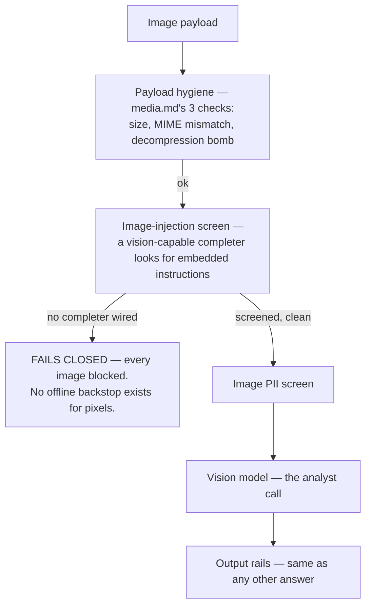

# Vision

## What it is

Image understanding, with the injection screen deliberately placed
**ahead of** the vision model, not after it. If you have never thought
about images as an attack surface before: a picture can contain rendered
text — a photo of a note, a screenshot with instructions embedded in it —
and a model that "reads" images can be manipulated by that embedded text
exactly the way a text prompt can. Screening has to happen on the way in,
before the model ever looks at the pixels.

## Why it exists here

The ordering is the entire point of this module, stated directly in its
own docstring as the actual pipeline:

```
payload hygiene → image-injection screen → image PII → vision model → output rails
```

A vision model that receives an unscreened image is exactly the same class
of gap as a text model receiving unscreened tool output (`guardrails.md`'s
OWASP LLM01 discussion) — an untrusted input channel with no rail in front
of it.

## Diagram



## The architecture

```
aegis/src/aegis/vision/
  __init__.py   the pipeline entrypoint; VisionAnalyst injection point
  analyst.py    VisionAnalyst — the injected vision-capable completer contract
```

## What is actually in Aegis

### `screen_completer` — omit it and every image is blocked, not passed

Quoted directly from the module's own usage example comment: `omit ⇒ every
image blocked`. This is the same fail-closed philosophy `guardrails.md`
describes for the injection classifier's text path, applied to images:
there is no offline, deterministic backstop for screening pixels the way
there is for text signatures, so a deployment that has not wired a vision
completer for screening cannot pass images through unscreened — it refuses
them outright rather than silently skipping the check.

### `VisionAnalyst` — injected, not hardcoded to one provider

The actual model call that "reads" an image is taken as an injected
`VisionAnalyst`, the same dependency-injection pattern used throughout the
codebase (the guardrail pipeline's `completer`, the gateway's
`ChatCompleter`) — this module does not hardcode a call to one specific
vision API; a host wires whichever vision-capable model deployment it has
configured.

## How it runs

1. The image passes `media.md`'s three hygiene checks (size, MIME,
   decompression bomb).
2. The image-injection screen inspects the image for embedded
   instructions, using the injected vision completer — or blocks
   outright if none is wired.
3. An image-PII screen runs (redacting or flagging visible personal data
   in the image itself, analogous to the text PII rail).
4. Only then does the actual vision analysis call happen.
5. The generated answer passes through the standard output guardrail
   chain, same as any text answer.

## What is not here

- **No offline fallback for the injection screen** — unlike text, where
  deterministic signatures catch the most egregious attacks with zero
  model cost, there is no equivalent free first pass for images; the
  screen is entirely model-backed or entirely absent.
- **A vision-capable completer is a separate injection point from the main
  text completer** — a host must wire both if it wants both text and image
  understanding; wiring one does not imply the other is available.
