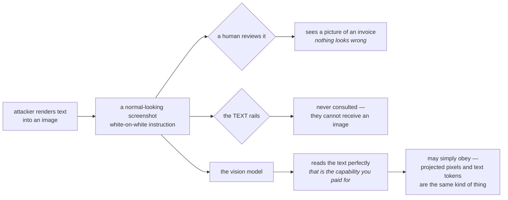
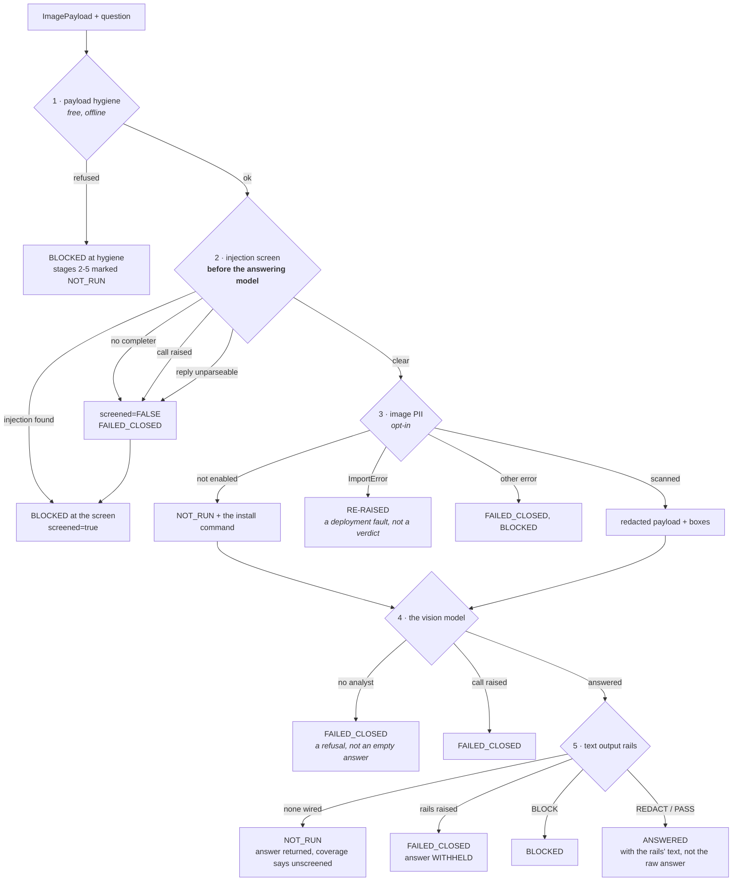
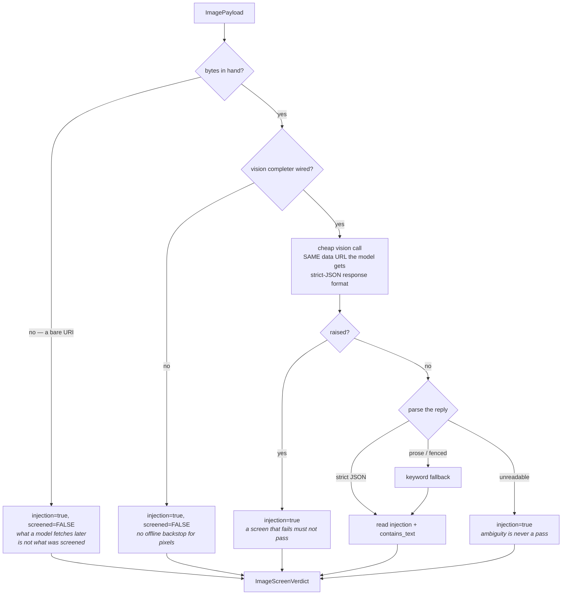
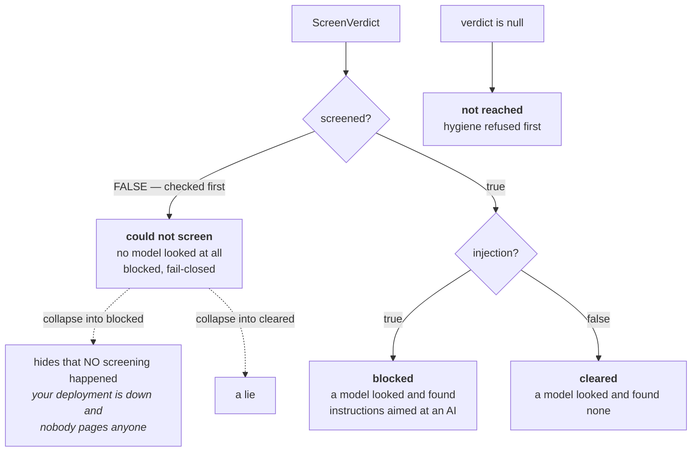
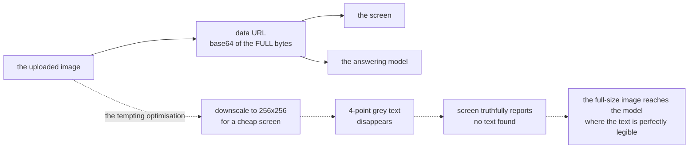
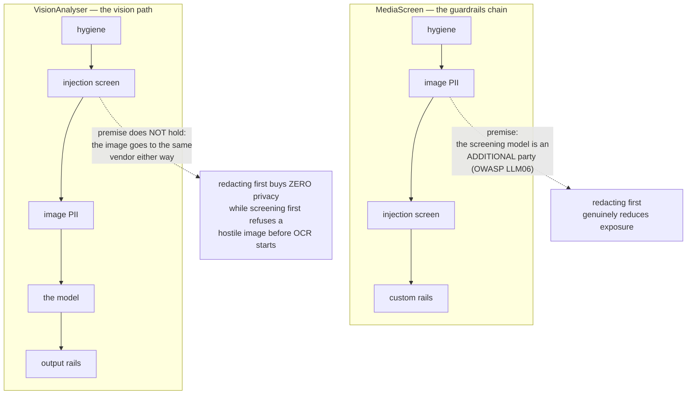
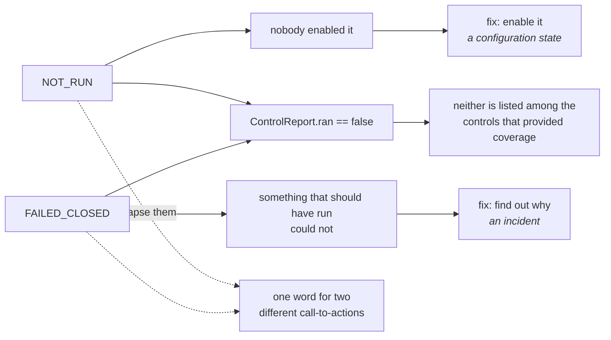
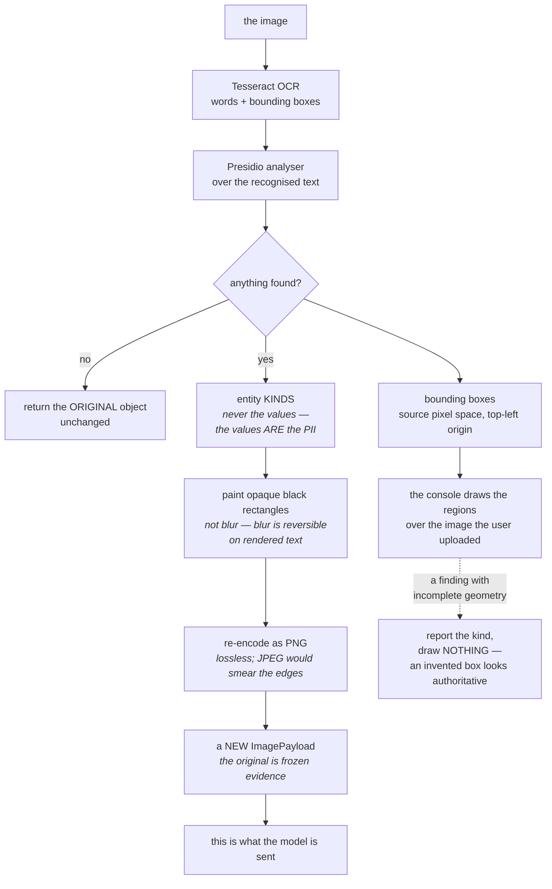
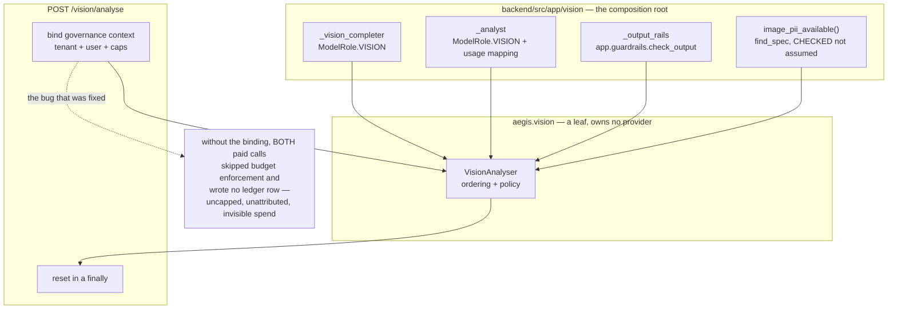

# Vision — the diagrams

Diagram 2 is the one to know by heart. If you can draw the five stages with their exits
and say what each `None` dependency does, you own this module.

---

## 1. Why the ordering exists — the attack

**Three reasons this is worse than text injection.** Invisible to human review. Passes
every text rail without touching one — they do not fail, they are never consulted. And
the carrier is innocuous: "users can upload screenshots" is a normal requirement nobody
flags.

---

## 2. The pipeline — the order IS the product

**Every arrow into a block also fills in `NOT_RUN` for every later stage**, so a refused
run still lists all five controls with reasons. A reader never infers coverage from a
missing entry.

---

## 3. Proving the ordering

```mermaid
flowchart TB
    subgraph WRONG["screen AFTER the model"]
        W1["call the vision model"] --> W2["get the answer"]
        W2 --> W3["screen the image"]
        W3 --> W4["suppress the answer if flagged"]
    end

    subgraph RIGHT["screen BEFORE the model"]
        R1["screen the image"] --> R2{"flagged?"}
        R2 -->|yes| R3["refuse — the model is never called"]
        R2 -->|no| R4["call the vision model"]
    end

    W4 --> SAME["identical verdict<br/>identical UI<br/>identical outcome assertions"]
    R3 --> SAME

    SAME --> DIFF["but: you PAID,<br/>the image is in provider logs,<br/>any tools already ran,<br/>the injection had its chance"]

    DIFF --> TEST["assert analyst.calls == &#91;&#93;"]
    TEST --> ONLY["the ONLY assertion that separates them"]
```

When the claim is about ordering or non-occurrence, **assert on the thing that should not
have happened.** Asserting on the outcome tests nothing, because both designs produce the
same outcome.

---

## 4. The screen, and its four fail-closed exits

**Two questions, not one.** `contains_text` and `injection` are separate fields, because
a photo of a receipt has text and is not an attack. A screen that refuses any image
containing text would refuse every document, chart and screenshot.

---

## 5. The three verdict states the console must show

**`screened` is checked before `injection`.** A fail-closed block carries
`injection=true` *and* `screened=false`; checking `injection` first would make the third
state unreachable.

---

## 6. Why the screen and the model must see the same bytes

Both call sites build the URL through the same `data_url` construction, and a test pins
them **equal**. "Cheap" must mean a cheaper **model**, never a cheaper
**representation**.

---

## 7. The deliberate ordering divergence

**An ordering rule is downstream of an argument.** When the premise changes, the correct
ordering changes with it. Both sites state the premise — otherwise the next reader
unifies them and silently makes one path worse.

---

## 8. `NOT_RUN` versus `FAILED_CLOSED`

A fail-closed control **blocked**, which is the right outcome — but it did not provide
coverage, so `coverage()` must not list it as if it did.

---

## 9. Image PII — verdict plus artefact plus evidence

A `REDACT` verdict with no redacted image is theatre: the caller is still holding the
original bytes. And a claim with no box is a claim, not evidence.

---

## 10. Backend wiring — where the leaf gets its dependencies

The leaf decides *what must clear before pixels reach a model*, and nothing else. The
host supplies the calls. That is what keeps `aegis.vision` importable with no gateway,
no `app.*`, and no local model.

---

**Next:** [`50-interview.md`](50-interview.md).
