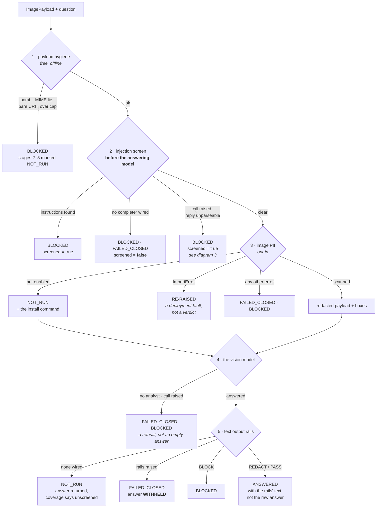
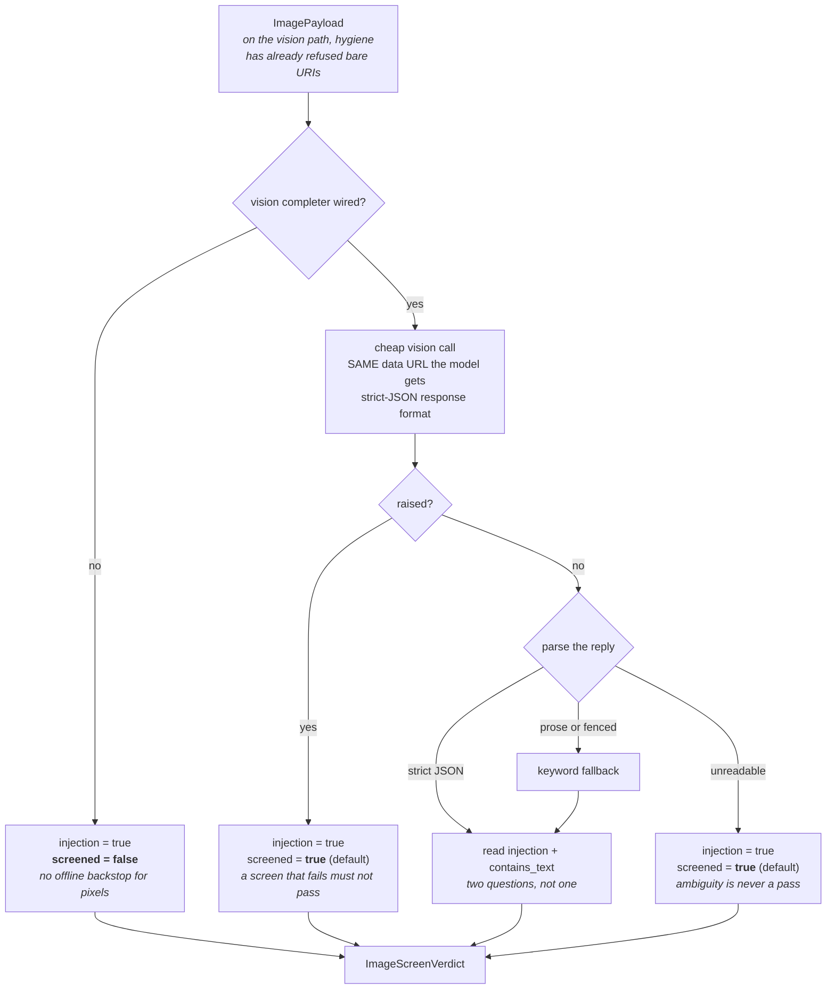
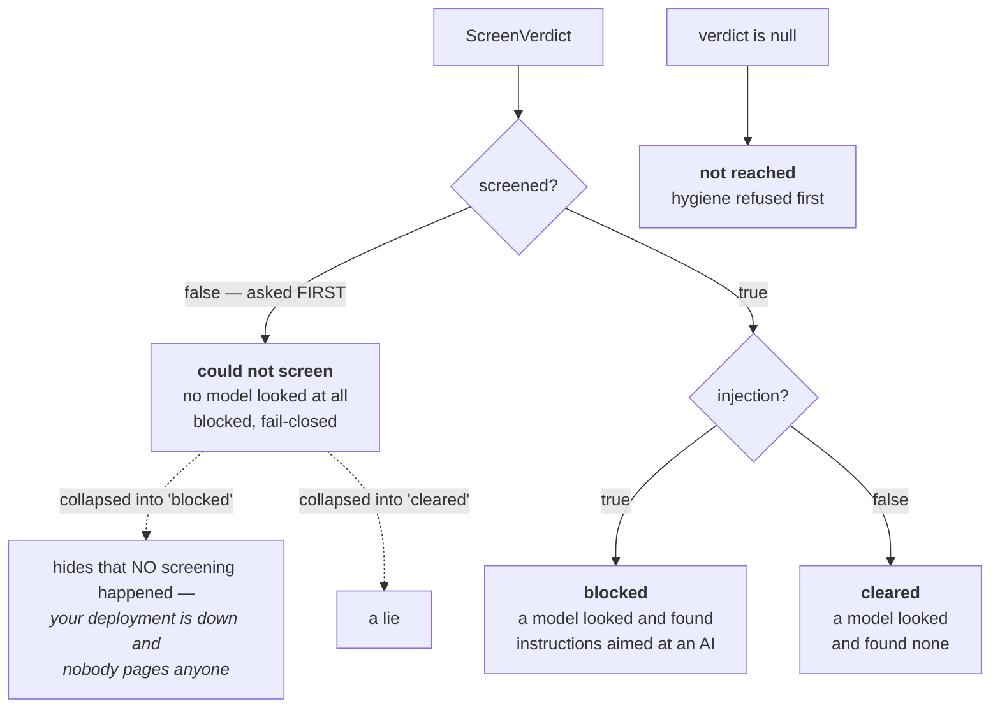
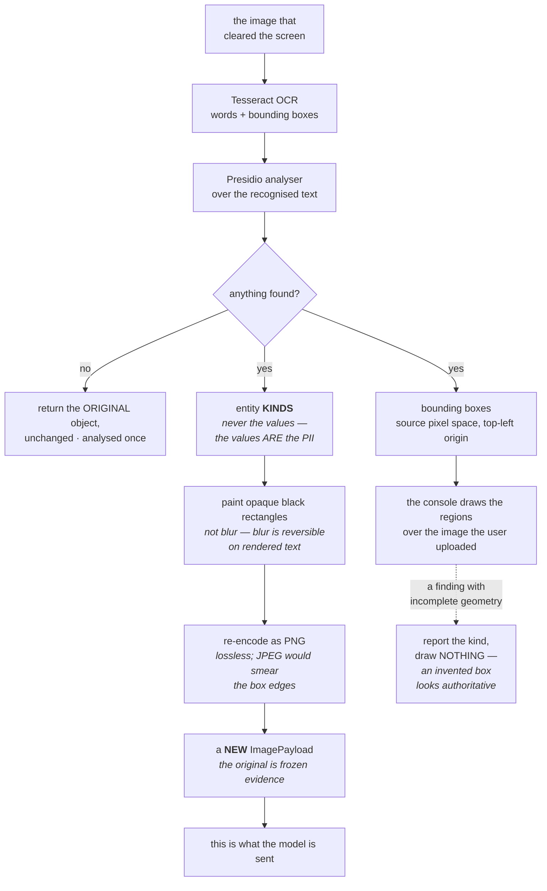

# Vision — the diagrams

Five diagrams. The two worth reproducing from memory are **the pipeline** and **the two
orderings** — between them they carry the whole argument for why this module exists.

Everything else about this module is explained in [`10-guide.md`](10-guide.md); a picture is only
here when it shows something prose cannot.

---

## 1. The pipeline — the order *is* the product

*Look at where the screen sits, and at the fact that every refusal exits sideways rather than
falling through.*

Every arrow into a block also fills in `NOT_RUN` for every *later* stage, so a run refused at
stage 1 still lists all five controls with reasons.

The one arrow that leaves the diagram is the `ImportError` — the single failure this pipeline
refuses to turn into a tidy verdict.

---

## 2. Two orderings, one observable outcome

*Look at where the two paths converge, and at what has already happened by the time they do.*

```mermaid
flowchart TB
    subgraph WRONG["screen AFTER the model"]
        W1["call the vision model"] --> W2["get the answer"]
        W2 --> W3["screen the image"]
        W3 --> W4["suppress the answer if flagged"]
    end

    subgraph RIGHT["screen BEFORE the model"]
        R1["screen the image"] --> R2{"flagged?"}
        R2 -->|yes| R3["refuse — the model<br/>is never called"]
        R2 -->|no| R4["call the vision model"]
    end

    W4 --> SAME["<b>identical</b> verdict<br/><b>identical</b> UI<br/><b>identical</b> outcome assertions"]
    R3 --> SAME

    W1 -.->|"already true on the left"| COST["you paid for the expensive call ·<br/>the hostile image is in provider logs ·<br/>any tools already ran ·<br/>the injection had its chance"]

    SAME --> TEST["<b>assert analyst.calls == &#91;&#93;</b>"]
    TEST --> ONLY["the only assertion<br/>the left-hand pipeline<br/>cannot satisfy"]
```

When the claim is about ordering or non-occurrence, assert on the thing that should *not* have
happened. Asserting on the outcome tests nothing — both designs produce the same outcome.

---

## 3. Inside the screen, and the two flags that come out

*Look down the refusal column: all three block, but only the top one reports `screened = false`.*

Every path blocks, so nothing unsafe reaches the model on any of them.

But `screened` is what the console uses to say *"no model looked at all"*, and a screen deployment
that is simply **down** takes the middle path — so it renders as an ordinary red block rather than
as an outage. That is a reporting gap, not a safety one, and it is worth raising.

---

## 4. The three states the console must show

*Look at the order of the two questions — `screened` is asked first, and it has to be.*

A fail-closed block carries `injection = true` **and** `screened = false`. Ask `injection` first
and the third state becomes unreachable.

---

## 5. Image PII — verdict, artefact, and evidence

*Look at the two outputs on the right: one goes to the model, the other to the console.*

A `REDACT` verdict with no redacted image is theatre: the caller is still holding the original
bytes. And a claim with no box is a claim, not evidence.

---

**Next:** [`50-interview.md`](50-interview.md)
