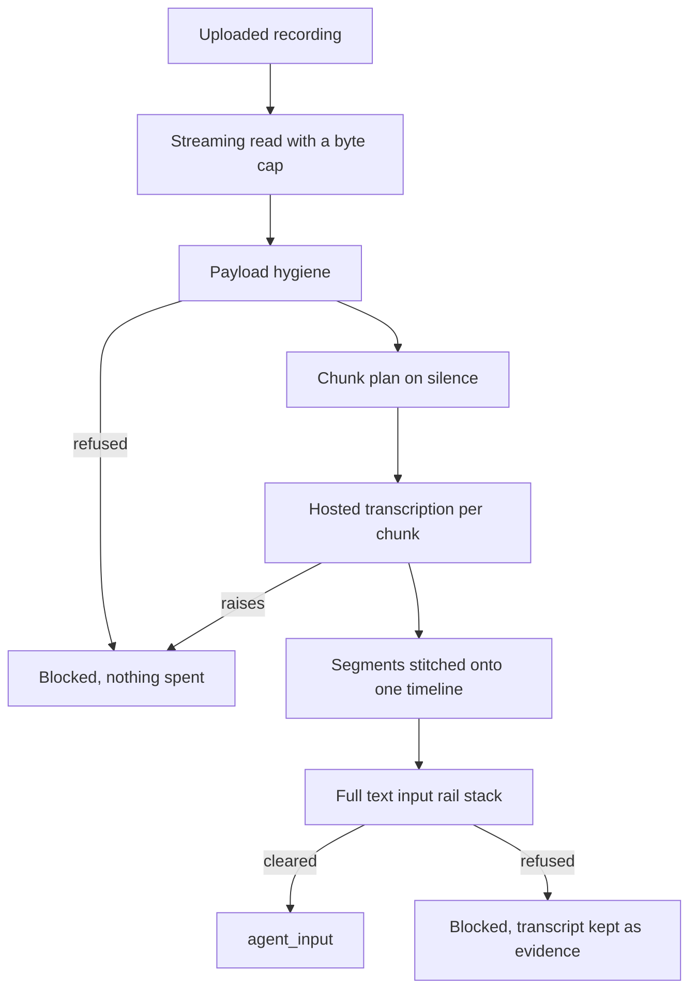

# Voice

## What it is

Voice turns a recording into text and then screens that text with the platform's
entire input guardrail stack before an agent is allowed to see it. It also splits
a long recording into transcribable pieces on natural pauses and stitches the
results back onto one timeline.

## Why it exists

Every attack that works in typed text works when spoken. If speech reached an
agent as a special case, the mature text rails — signatures, the injection
classifier, content safety, PII, schema, topical, and any custom rail the
operator added — would all be bypassed by pressing a microphone button.

## Diagram

## How it works

**1. The upload is read with a hard cap, streamed.** The route reads the
multipart file in 64 KiB pieces and abandons the read the moment the running
total passes `MAX_UPLOAD_BYTES` (8 MiB, deliberately the same number as
`MediaLimits.max_bytes` so the transport refusal and the hygiene refusal agree).
Reading the whole thing and *then* measuring it is the denial of service the cap
exists to prevent. Over the cap is a 413.

Multipart rather than base64: base64 inflates a payload by about a third — on an
8 MiB cap that is 2.7 MiB of pure overhead — and it forces the whole recording to
exist as one JSON string on both sides before anything can look at it, which
defeats a streaming size check.

**2. Hygiene runs before any spend.** `aegis.media.inspect_payload` refuses a
payload whose declared MIME type is a lie, whose bytes are unreadable, or which is
over the cap — before a paid transcription request is made.

**3. Long recordings are split on silence.** A hosted speech-to-text deployment
has a request ceiling, and one 40-minute request is also one 40-minute failure
domain. `chunking.py` builds a loudness envelope over 20 ms windows, aims for a
target boundary, then searches *backwards* from it for the quietest stretch and
cuts in the middle of it. Cutting at a fixed offset lands mid-word almost always,
and the model has no context across the cut, so both halves come back wrong.

| `ChunkPolicy` field | Default | What it controls |
|---|---|---|
| `max_chunk_seconds` | 120.0 | Hard ceiling on one chunk |
| `min_chunk_seconds` | 5.0 | Never split this close to the chunk's start |
| `search_seconds` | 20.0 | How far back from the target to hunt for a pause |
| `silence_ratio` | 0.18 | A window is silence when its RMS is below this fraction of the clip's RMS — relative, because recording levels vary by orders of magnitude |
| `min_silence_seconds` | 0.25 | A pause must last this long to count as a boundary, not a stop consonant |

The splitter is pure standard library, working on uncompressed PCM RIFF/WAVE via
the `wave` and `array` modules — no ffmpeg, no torch, no local model. A container
it cannot parse (MP3, OGG, FLAC, M4A) is transcribed **whole**, in one request,
and `ChunkPlan.note` says exactly that. It never returns a "chunked" plan that is
really one chunk.

**4. Transcription goes through the gateway.** `aegis.gateway.transcribe` routes
`ModelRole.VOICE` to the fleet's hosted Whisper deployment, checks the budget
*before* the spend, bills per audio-second and opens its own trace span. This
module re-implements none of that.

**5. Chunk transcripts are stitched onto the recording's timeline.** Each chunk's
start offset is added back to every segment timestamp, and segments are
renumbered end to end — so `VoiceSegment.start` is seconds from the start of the
*whole recording*, not from the chunk.

**6. The transcript goes through the entire text input stack.** `text_check` is
the caller's complete rail stack — in the backend, the same `check_input` the
agent graph guards typed input with, including whichever engine the operator
selected and any custom rail they added. Only what the rails return is exposed as
`agent_input`.

**Every failure direction is closed.** Hygiene refused, no transcriber wired, no
text rail stack supplied, or a transcription that raised — each ends in a `BLOCK`
verdict whose reason names the control that could not run. There is no path in
this module that returns agent-usable text without the rails having judged it.

**The result separates evidence from input.** `VoiceResult.transcription.text` is
the transcript, for the operator's console. `VoiceResult.agent_input` is what the
rails returned, and it is `None` when they refused. A client that forwards the
transcript instead has bypassed the rails, which is why the console sends the
second field.

**Controls are itemised, including the missing one.** `controls_run` and
`controls_skipped` list them by name. Speaker diarisation is always in
`controls_skipped`: the hosted deployment reports no speaker labels and policy
forbids a local model, so no speaker attribution is produced and the coverage
line says so rather than staying quiet.

**Streaming.** `aegis.voice.stream` emits `voice_chunk` as each chunk returns
(carrying the running transcript), `voice_transcript` when the transcription is
finished, and `guardrail_media` for the rail verdict. The verdict reuses the media
guardrail event name rather than inventing a voice one, because it *is* a media
verdict and the console's existing renderer already understands it.

## What it stores

This module stores nothing. Audio is never persisted, and the transcript lives
only in the response.

The HTTP route writes one `voice.transcribe` row to `audit_log` carrying the
filename, the byte count, the cap in force, the rail verdict, the chunk count and
the transcript **length**. The transcript text itself is user content and is never
audited. The transcription call is recorded in `usage_ledger` by the gateway.

## Security and tenant isolation

**Who may call.** `POST /v1/voice/transcribe` requires authentication; any role
may transcribe their own audio.

**Governance is bound around the call.** The caller's tenant, user and caps are
resolved and bound before transcription so the gateway's `VOICE` call is
budget-enforced and ledgered per audio-second exactly like a chat completion, and
reset in a `finally` so the context cannot leak onto the next request.

**Billing is per audio-minute, not per token.** The role's billing unit is
`audio_minutes`. Carrying the unit explicitly is what stops a per-minute call
from being ledgered as zero prompt tokens and therefore $0.00, which would let a
tenant with a USD cap transcribe without limit.

**The ordering is the control.** Transcribe first, because a rail cannot judge
what it cannot read; then screen; then expose only what the rails returned. That
ordering belongs to `aegis.voice`, not to the host wiring, so a host would have
to go out of its way to break it.

**No tenant data is stored here**, so there is nothing in this module to scope.
Isolation applies at the gateway (spend and ledger) and in the audit trail.

## API surface

| Method | Path | Who may call it | Returns |
|---|---|---|---|
| POST | `/v1/voice/transcribe` | any authenticated principal | The transcript, detected language, duration, time-aligned segments, whether confidence was reported, the model, chunk count and chunking note, cost and audio seconds billed, the rail verdict with its reason, layer and redactions, the run and skipped control lists, and `agent_input` |

The body is `multipart/form-data`: `file` (wav, mp3, ogg, flac or m4a) and an
optional `language` hint (ISO-639-1; omit it to let the model auto-detect). An
upload over the cap returns 413.

`agent_input` is `null` whenever the rails refused. `has_confidence` is what a
console reads to decide between showing a number and showing "not reported" —
`VoiceSegment.confidence` is carried through when a provider reports one and is
never filled in with a derived or invented value.

## Configuration

| Variable | Default | Effect |
|---|---|---|
| `MODEL_VOICE` | `genailab-maas-whisper` | The deployment `ModelRole.VOICE` routes to |
| `COST_VOICE_IN` / `COST_VOICE_OUT` | `0.006` / `0.0` | Ledger rates — input is per minute of audio |
| `COST_VOICE_UNIT` | `audio_minutes` | The billing unit for the role's input rate |

The upload cap and the chunk policy are code, not environment: `MAX_UPLOAD_BYTES`
in `app.voice.service` (read at call time, so a test can change it) and
`ChunkPolicy` defaults in `aegis.voice.chunking`. Both are overridable per call.

## Where it lives

| Path | What it does |
|---|---|
| `aegis/src/aegis/voice/transcribe.py` | `transcribe_audio`, `transcribe_and_guard`, `make_transcriber` — hygiene, the gateway call, and the rail ordering |
| `aegis/src/aegis/voice/chunking.py` | `ChunkPolicy`, `AudioChunk`, `ChunkPlan` — the silence-aware splitter |
| `aegis/src/aegis/voice/types.py` | `VoiceSegment`, `VoiceTranscription`, `VoiceResult` |
| `aegis/src/aegis/voice/stream.py` | The `voice_chunk`, `voice_transcript` and `guardrail_media` stream events |
| `backend/src/app/voice/service.py` | `read_upload` with the streaming cap, and `transcribe_upload` wiring this platform's rails |
| `backend/src/app/voice/__init__.py` | The composition root: the gateway call and `app.guardrails.check_input` |
| `backend/src/app/api/routes.py` | Serves `POST /v1/voice/transcribe` and binds the governance context |

## What it does not do

- **It does not run a local speech model.** No ffmpeg, no torch, no local
  Whisper; the fleet deployment does the work.
- **It does not produce speaker labels.** Diarisation is named in
  `controls_skipped` on every run.
- **It does not chunk compressed audio.** MP3, OGG, FLAC and M4A are transcribed
  whole, and the response says so in its chunking note.
- **It does not synthesise speech.** This path is speech to text only.
- **It does not store audio or transcripts.** Both live for the duration of the
  request.
- **It does not hand raw audio to an agent.** The only route from a recording to
  an agent is `agent_input`, and that is `None` unless the rails cleared it.
