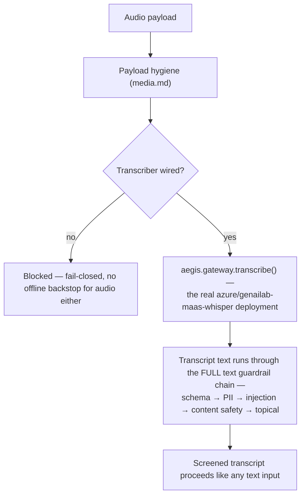

# Voice

## What it is

Speech-to-text, followed by the **full text guardrail chain** run over the
transcript — never a shortcut path for audio. If you have never thought
about audio as a prompt-injection vector: a voice message can say "ignore
your instructions" exactly as effectively as typed text, once transcribed
— so the security question for audio is entirely about what happens to the
text *after* transcription, not about the audio itself.

## Why it exists here

Quoted directly, and it names the module's one real security property:
*"the security ordering — transcribe first, then run the caller's **entire**
text rail stack over the transcript... Nothing here bypasses the rails, and
nothing here fails open: no transcriber, no [pass-through]."* An audio
clip with no transcriber wired is blocked, not silently allowed to reach
the model as raw, unscreened audio.

## Diagram



## The architecture

```
aegis/src/aegis/voice/
  __init__.py    transcribe_and_guard(), stream_transcribe_and_guard(), make_transcriber()
  transcribe.py  the thin layer over aegis.gateway.transcribe
```

## What is actually in Aegis

### A thin, honest layer — the gateway already does the real transcription work

Quoted: *"A thin, honest layer over `aegis.gateway.transcribe`. The gateway
already [handles pricing and provider details]."* This module's own job is
narrow and specific: sequence transcription before the text rails, and
correctly handle the container format question below — it does not
reimplement speech recognition itself.

### Container format handling — PCM WAV parsed directly, everything else "transcribed whole and says so"

The module distinguishes two cases explicitly: PCM WAV audio can be parsed
with pure stdlib Python (no external audio library dependency needed for
that one format). Any other container format is sent to the transcription
model **whole**, without local parsing — and the result is honestly
labelled as such, rather than the module pretending it performed the same
level of local inspection on every format uniformly.

### The real deployment — `azure/genailab-maas-whisper`

The gateway's live Whisper deployment is named directly in this module's
own docstring as what it calls through, returning real segment and
language metadata for a transcription — not a placeholder or mocked
provider in the actual running configuration.

### Fail-closed, matching vision's own philosophy

Quoted again for emphasis, because it is the core security property:
*"nothing here fails open: no transcriber, no [pass-through]."* Exactly
the same posture as `vision.md`'s image-injection screen — an unconfigured
media pathway blocks rather than silently skips screening.

## How it runs

1. Audio clears payload hygiene.
2. If no transcriber is wired, the payload is blocked outright.
3. `aegis.gateway.transcribe()` calls the real Whisper deployment,
   returning text plus segment/language metadata.
4. The **entire** text guardrail chain — the same one any typed message
   goes through — runs over the resulting transcript.
5. Only a transcript that clears every text rail proceeds further.

## What is not here

- **No separate, audio-specific injection screen** — unlike vision, which
  has its own dedicated image-injection check, voice relies entirely on
  the transcript passing through the standard text rail stack; there is
  no analysis of the audio signal itself for anything beyond
  transcription.
- **Non-WAV containers are not locally parsed or pre-validated** beyond
  what hygiene already checks — they are sent to the transcription
  provider as a whole file, and the module is explicit that this is a
  different (less locally-inspected) path than PCM WAV.
