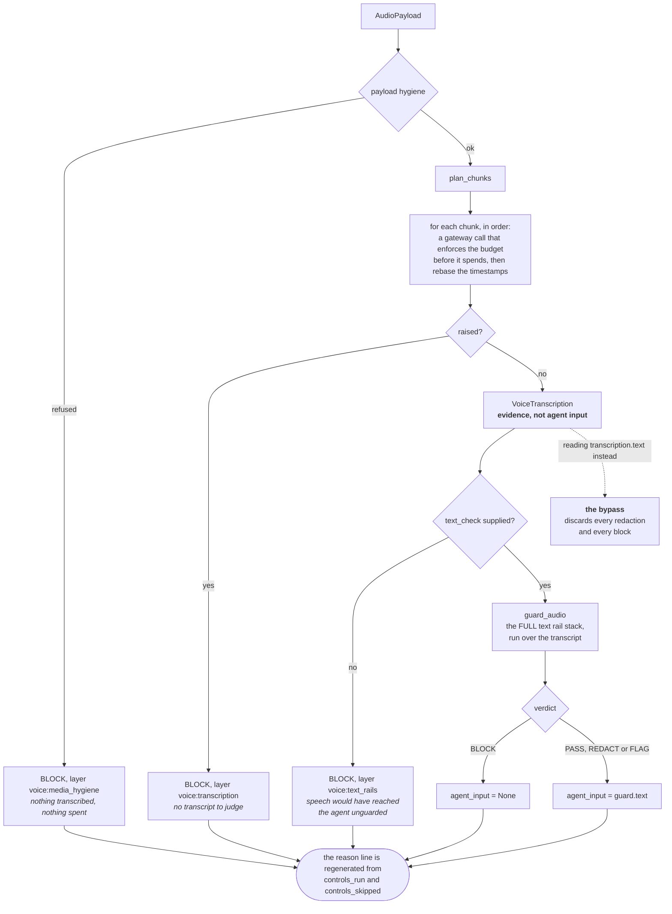
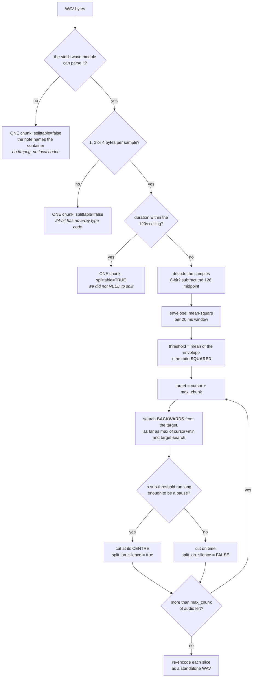
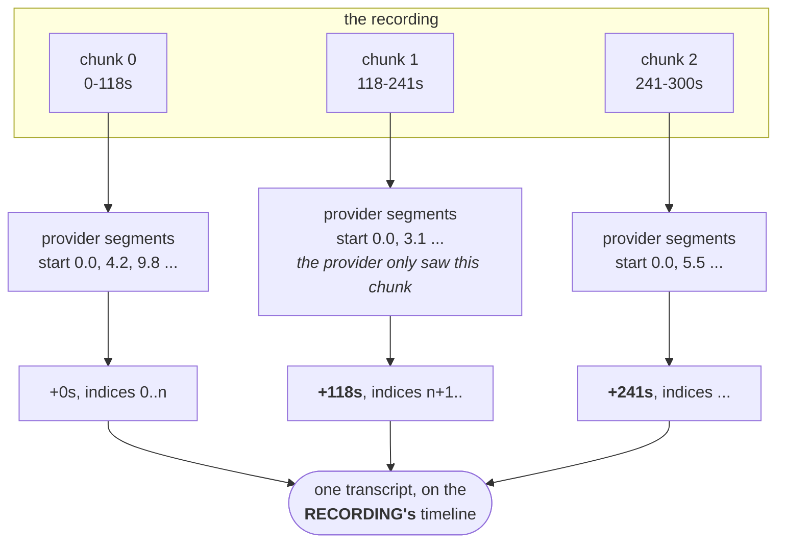
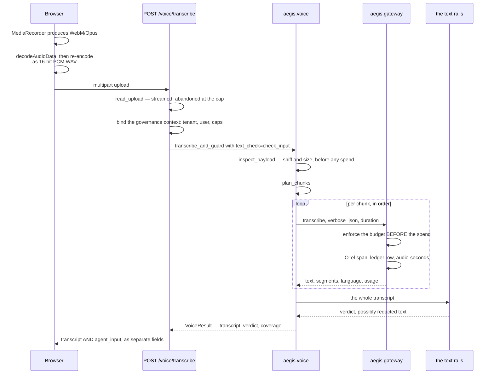

# Voice — the diagrams

Four diagrams. The two worth reproducing from memory are **the guarded path**, with all four
fail-closed exits and the bypass it exists to prevent, and **the silence splitter**.

Everything else about this module is explained in [`10-guide.md`](10-guide.md); a picture is only
here when it shows something prose cannot.

---

## 1. The guarded path — every exit closes

*Look at the dotted edge off `VoiceTranscription`. That is the one-attribute bypass.*

**Four exits, one direction.** Hygiene refusal, transcription error, a missing rail stack and a
rail block all end in BLOCK. No path through this function returns agent-usable text the rails
have not judged.

The dotted edge is why `agent_input` is a **computed property** rather than a field: a field could
hold the unscreened string and be read by mistake, and a property derived from `guard.text` never
holds it at all. It returns `None` on a block, not `""` — an empty string flows silently through
concatenation and formatting.

Hygiene runs before the first paid call, which is why the test asserts the transcriber was never
called rather than merely that the verdict was BLOCK.

---

## 2. The silence splitter

*Look at the search direction, and at the two places a "one chunk" plan comes from.*

**Three details make it work.** The threshold is *squared*, because the envelope is mean-square
while the ratio is an amplitude ratio — forget it and the threshold is 5.6x too generous, so
ordinary quiet speech reads as silence and cuts land mid-word. The threshold is *relative to this
clip*, because levels vary by orders of magnitude between a headset and a laptop mic. And the
search runs *backwards*, so no chunk can exceed the ceiling.

Both single-chunk outcomes produce `len(chunks) == 1`, and they carry very different risk: a
30-second note correctly sent as one request, or a 40-minute MP3 that could not be split at all.
That is why there is a `splittable` flag *and* a prose note.

---

## 3. Chunk timelines are rebased onto the recording

*Look at the two offsets. Drop them and every timestamp after chunk 0 is wrong.*

Offsets below are illustrative — where the cuts land depends on where the pauses are.

Each chunk is a separate request, so the provider restarts its clock at zero every time.
Concatenating without adding the offset back leaves click-to-seek landing further and further
from the right moment as the recording goes on.

Segment indices are renumbered transcript-wide for the same reason — the provider's are
per-request. A test asserts both: the indices form an unbroken range, and segment starts only ever
increase.

---

## 4. End to end, browser to agent

*Look at the last line. Two strings come back, and only one may be forwarded.*

**Why the browser re-encodes.** Chrome's `MediaRecorder` emits WebM/Opus, which payload hygiene
would correctly refuse, and the server's chunker is built on the stdlib WAV parser — so a long
recording only chunks at all if it arrives as PCM WAV.

**Why the chunks are sequential.** Chunk *k+1* is checked against a balance that already includes
chunk *k*'s spend. Concurrent calls would each see the pre-spend balance and could collectively
blow past the cap.

**Why the response separates the two fields.** They are different things: one is evidence, one is
what an agent may consume. A client that forwards `transcript` has bypassed the rails.

**Next:** [`50-interview.md`](50-interview.md).
