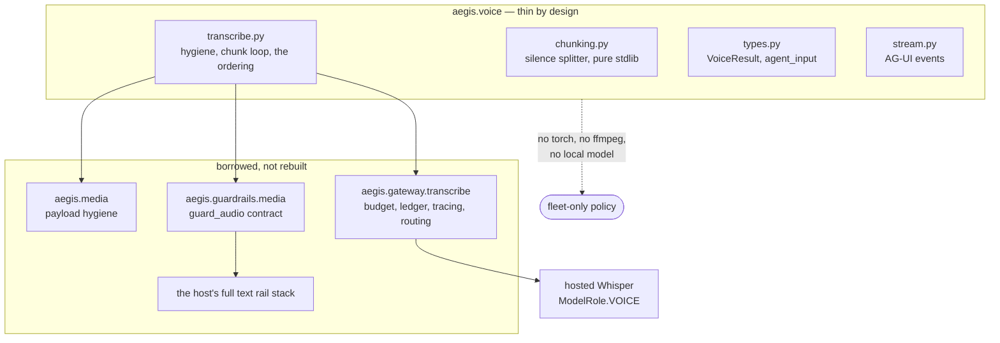
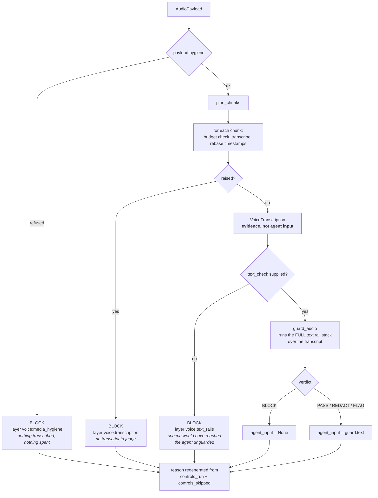
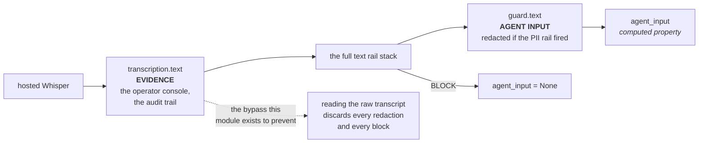
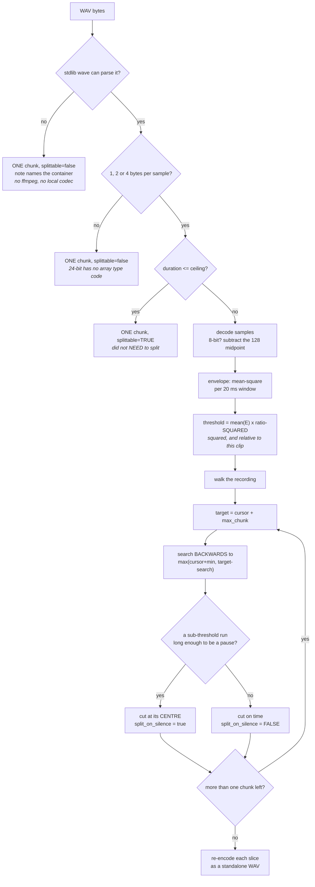
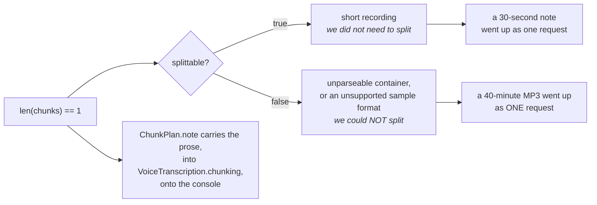
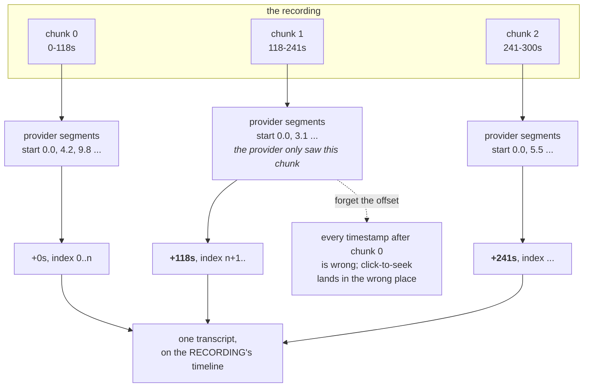
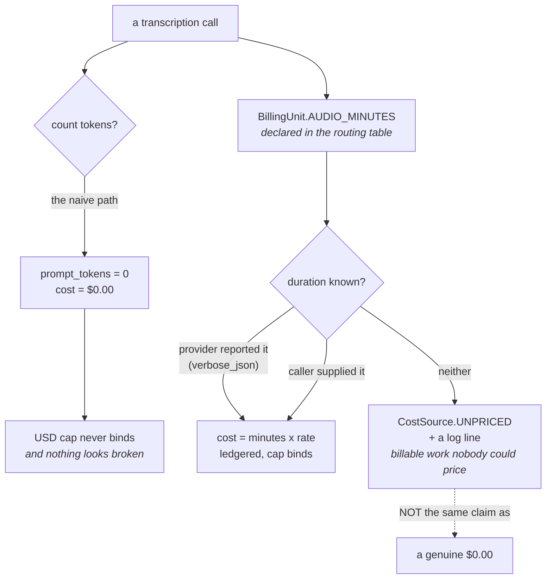
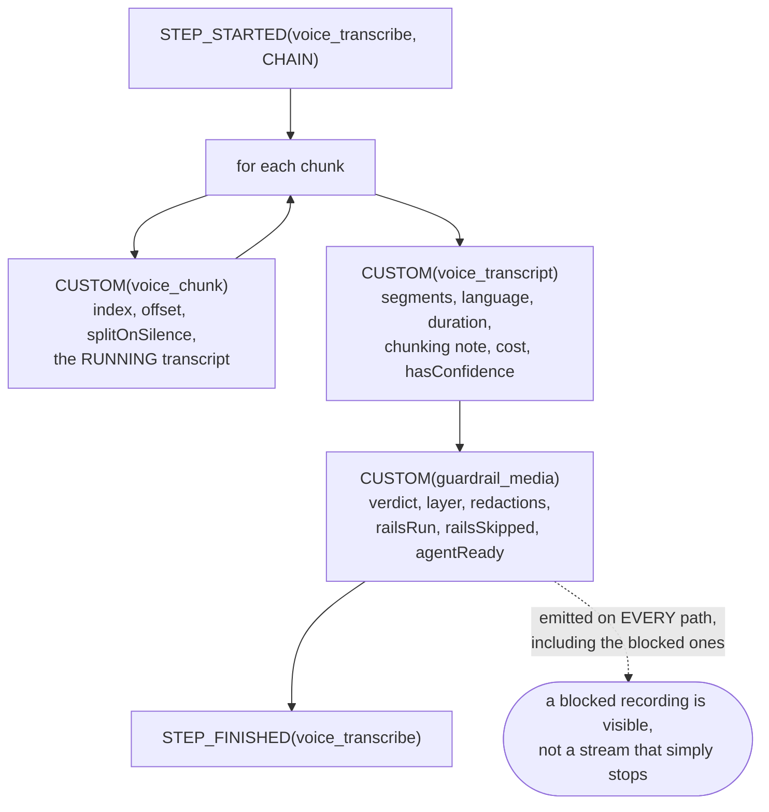
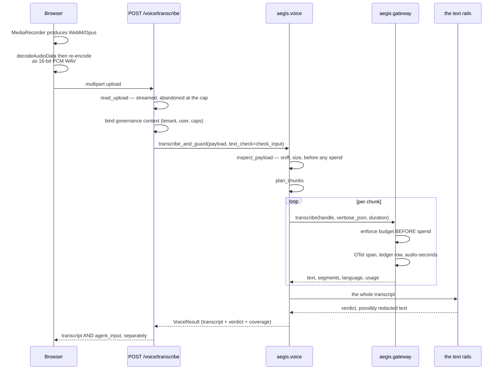

# Voice — the diagrams

If you can draw diagram 2 (the guarded path with all four fail-closed exits) and
diagram 4 (the silence splitter) on a whiteboard, you can hold a long conversation
about this module.

---

## 1. What this module owns, and what it borrows

**The point of the borrowing.** Routing speech through the gateway means transcription
is budget-enforced, ledgered per audio-second and traced — with no new code. A local
model would sit outside all of it.

---

## 2. The guarded path — every exit closes

**Four exits, one direction.** Hygiene refusal, transcription error, missing rail stack
and a rail block all end in BLOCK. There is no path through this function that returns
agent-usable text the rails have not judged.

---

## 3. The two texts, and why only one may reach an agent

**Why a computed property and not a field.** A field could hold the unscreened string
and be read by mistake. A property that derives from `guard.text` never holds it at all
— so the wrong value is not merely discouraged, it is **absent**.

And `None`, not `""` — an empty string flows silently through concatenation and
formatting; `None` does not.

---

## 4. The silence splitter

**Three details that make it work.** The threshold is **squared**, because the envelope
is mean-square and the ratio is an amplitude ratio — forget it and everything looks like
silence. The threshold is **relative to this clip**, because levels vary by orders of
magnitude between a headset and a laptop mic. And the search runs **backwards** from the
target, so no chunk can exceed the ceiling.

---

## 5. "One chunk" is two different outcomes

A caller counting chunks cannot tell these apart. That is why the flag and the prose
note both exist.

---

## 6. Chunk timelines are rebased onto the recording

---

## 7. Billing — why the unit has to be in the routing table

**The generalisable check:** when you add a modality, ask whether its billing unit is
the one your budget system counts. Images-per-call and audio-seconds are both ways for
spend to become invisible.

---

## 8. The streaming view

The verdict reuses the **media** event name rather than inventing a voice one — it *is*
a media verdict, the console's renderer already understands it, and a second name would
let the two drift.

---

## 9. End to end, browser to agent

**Why the browser re-encodes.** Chrome's `MediaRecorder` emits WebM/Opus, which payload
hygiene would correctly refuse — and the server's chunker is built on the stdlib WAV
parser, so a long recording only chunks if it arrives as PCM WAV.

**Why the response separates `transcript` from `agent_input`.** They are different
things. One is evidence; one is what an agent may consume.

---

**Next:** [`50-interview.md`](50-interview.md).
