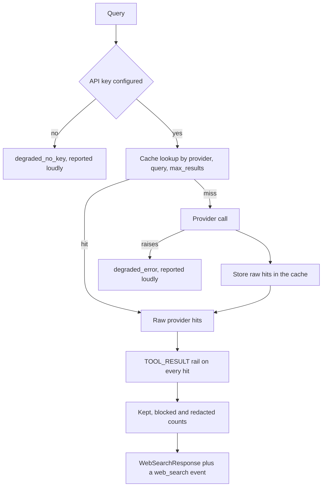

# Web search

## What it is

Web search is a provider-neutral seam for asking the public internet a question.
It caches answers so a repeated query costs nothing, screens every hit through the
tool-result guardrail before it can reach a model, and reports out loud when it
could not search at all.

## Why it exists

An agent that can only read the internal corpus cannot answer a question about
something that happened last week. Wiring a vendor SDK straight into the agent
would create three problems at once: a hard dependency on one provider, a cost
per repeated query, and arbitrary third-party text arriving in a model's context
with nothing looking at it.

## Diagram



## How it works

**The platform depends on a protocol, not a vendor.** `WebSearchClient` needs a
stable `name` and one `search(query, *, max_results)` coroutine.
`TavilyWebSearchClient` is one implementation; a fake in a test is another.
Swapping Tavily for Brave, SerpAPI or an internal search service is a new class
in this package and one line in the composition root — nothing in the agent, the
guardrails or the cache changes.

**The cache is asked first.** The key is a SHA-256 digest of `(provider,
normalised query, max_results)`. `normalise_query` case-folds and collapses
whitespace, so "Latest  FDA Guidance" and "latest fda guidance" are one entry;
nothing else is touched, because punctuation changes meaning in a search query.
Every part of the key matters: two providers answer the same query differently,
and a 5-result request must not be served from a 3-result entry.

**There is deliberately no tenant in the key.** A public web page is the same page
for everybody, and one provider call answering every tenant who asks the same
question is the point. What makes sharing safe is the *value*: `CachedWebResults`
holds the provider's raw hits and nothing else — not the query that found them,
and not any tenant's guardrail verdict.

**Screening happens after the cache, never inside it.** Every hit passes the
`TOOL_RESULT` rail before it is returned, on a warm cache exactly as on a cold
call. The rails are tenant-scoped — denylist terms and PII entity sets are merged
per tenant — so a cached verdict would mean whichever tenant searched first
decided what every later tenant was allowed to see.

Search results are arbitrary third-party text that a model reads as context, which
is the indirect prompt-injection surface. This is the only place in a turn that
looks at them. A blocked hit is **reported**, not quietly dropped: it appears in
`blocked` with its URL, the rail layer and the reason. A hit the rail rewrote
(PII redaction) is counted in `redacted`.

**Degradation is loud.** Three outcomes that would otherwise look identical are
kept apart:

| `WebSearchStatus` | Meaning |
|---|---|
| `ok` | The provider answered, live or from cache |
| `degraded_no_key` | No API key. Nothing external was called. |
| `degraded_error` | The provider was configured and the call failed — network, auth or rate limit |

`status.degraded` is the single property a caller checks. A search that ran and
found nothing, a search that never ran, and a search whose content was blocked
must never collapse into "no evidence". A degraded run logs at ERROR and still
emits its event.

**A failed search never crashes a run.** `search()` does not raise for a provider
failure. A research agent that dies on a flaky web call is worse than one that
says it had no web evidence.

**The event carries counts, never content.** `web_search` emits `provider`,
`status`, `degraded`, `cached`, the number of results, blocked and redacted
counts, and the reason — enough for a console to show a degraded search as
degraded, without putting page text on the stream.

**A missing guardrail is itself reported.** With no `guard` wired, the results are
returned and an ERROR is logged saying that third-party web content is reaching an
agent's context unscreened.

**The provider SDK is optional and lazy.** `tavily-python` installs with
`aegis[websearch]` and is imported on first use, so importing this module on a
machine that never installed it is free. A missing package raises an ImportError
naming the exact install command — the adapter does not degrade silently, because
deciding *how* to degrade belongs to `WebSearch`, which says so out loud.

## What it stores

No database tables. The only persistence is the cache, and it is deliberately
shallow:

| Backend | When it is used | Properties |
|---|---|---|
| `RedisWebSearchCache` | `AEGIS_MODE=full` | Keys carry a schema version prefix. A sorted-set index tracks the module's own keys so the entry cap holds across processes, and the oldest entries past the cap are trimmed. |
| `InMemoryWebSearchCache` | `lite` and `auto` modes | Per-process, capped, non-durable. Selected with a warning naming the mode. |

`make_web_search_cache(mode)` chooses by explicit mode. `full` mode **requires** a
Redis client and raises a `RuntimeError` naming the escape hatch if none is
supplied; there is no silent fall-through to in-memory.

The cached value is a `CachedWebResults`: the provider's raw hits only. Default
TTL is 3600 seconds and the default cap is 512 entries.

## Security and tenant isolation

**The cache is shared across tenants by design**, and its safety comes from what
it is allowed to hold rather than from who can read it. The key is a one-way
digest of the query, and the value carries no query text and no tenant's verdict —
so read access to the cache is not a log of what anybody asked.

**The verdict is never shared.** Screening runs after every cache read with the
calling tenant's own rails, so one tenant's policy can never decide what another
tenant sees.

**Every hit is screened.** The `TOOL_RESULT` rail is called per hit with
`tool_name="web_search"`, and a block is recorded rather than silently dropped.

**No credential reaches a caller.** The API key is read from the environment when
the client is built and lives only inside the client object.

## API surface

No HTTP routes. This is a library. A host composes it:

```python
from aegis.guardrails import Guardrails
from aegis.websearch import WebSearch

search = WebSearch.from_env(guard=Guardrails())
answer = await search.search("latest guidance", emitter=emitter)
if answer.degraded:
    ...  # no web evidence — NOT "the web had nothing"
```

`search()` takes the query, an optional `max_results` override (default 5) and an
optional emitter — anything with an async `custom(name, value)` method. It returns
a `WebSearchResponse` carrying `query`, `results`, `provider`, `status`, `cached`,
`reason`, `blocked` and `redacted`.

## Configuration

| Variable | Default | Effect |
|---|---|---|
| `TAVILY_API_KEY` | `""` | The Tavily key. Unset is a supported posture: the search degrades with `status=degraded_no_key` and says so. |
| `AEGIS_MODE` | `full` | Selects the cache backend. `full` requires a Redis client; `lite` and `auto` use the in-memory cache. |
| `AEGIS_REDIS_URL` | unset | The Redis/Memurai instance the full-mode cache uses |
| `WEB_SEARCH_CACHE_TTL_SECONDS` | `3600` | How long a cached search stays warm |
| `WEB_SEARCH_CACHE_MAX_ENTRIES` | `512` | Cap on cached searches. An unbounded cache of arbitrary web pages is the quickest route to memory pressure. |

`TAVILY_API_KEY` is the only spelling read. If `TRAVILY_API_KEY` is set and
`TAVILY_API_KEY` is not, an ERROR names the rename rather than honouring the
second spelling, so two names cannot both appear to work.

## Where it lives

| Path | What it does |
|---|---|
| `aegis/src/aegis/websearch/types.py` | `WebSearchResult`, `WebSearchResponse`, `WebSearchStatus`, `BlockedResult`, and the `WebSearchClient` / `ToolResultScreen` protocols |
| `aegis/src/aegis/websearch/service.py` | `WebSearch` — cache lookup, provider call, per-hit screening, degradation and the event |
| `aegis/src/aegis/websearch/tavily.py` | The Tavily adapter and the API-key constants |
| `aegis/src/aegis/websearch/cache.py` | `cache_key`, `normalise_query`, `CachedWebResults`, both cache backends and `make_web_search_cache` |
| `backend/src/app/config.py` | The host settings: key and cache TTL/cap |

## What it does not do

- **It does not fetch or render a page.** It returns the provider's title, URL,
  content snippet, score and publication date.
- **It does not rank or deduplicate.** Ordering is the provider's.
- **It does not expose an HTTP route.** Search is reached through an agent turn,
  not as its own endpoint.
- **It does not cache the verdict.** Only raw hits are shared; screening is
  redone per caller.
- **It does not retry a failed provider call.** One failure degrades the run and
  reports it.
- **It does not silently choose a cache backend.** `full` mode without Redis
  raises rather than dropping to memory.
