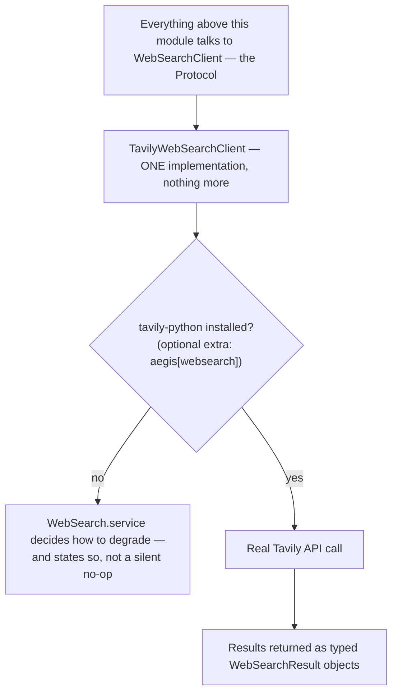

# Websearch

## What it is

The module that lets an agent reach outside a tenant's own ingested corpus
— a real web search, currently via Tavily. If you have never thought about
what "grounding" means once a search leaves your own data: an answer
grounded in a tenant's own documents (see `retrieval.md`) has a very
different trust story than an answer grounded in a live web page nobody
vetted — this module is the seam where that second, weaker kind of
grounding enters the system, and it is built to be swappable and honest
about degrading.

## Why it exists here

Not every question a tenant asks can be answered from their own uploaded
documents — sometimes the genuinely correct answer requires current
information from the open web. This module provides that path, deliberately
isolated behind a small interface so the specific provider (Tavily today)
is a swappable implementation detail, not something the rest of the
platform is coupled to.

## Diagram



## The architecture

```
aegis/src/aegis/websearch/
  types.py     WebSearchClient Protocol, WebSearchResult
  tavily.py    TavilyWebSearchClient — the one real implementation today
  service.py   WebSearch — decides how to degrade when no client is available
```

## What is actually in Aegis

### One implementation behind a Protocol — swapping providers is a new class, not a rewrite

Quoted directly: *"Everything above this file talks to the protocol.
Swapping Tavily for Brave, SerpAPI or an internal search service is a new
class in this package and one line [to register it]."* Nothing calling
into websearch is coupled to Tavily specifically — the rest of the
platform depends on `WebSearchClient`, the Protocol, and `tavily.py` is
simply the one concrete class currently satisfying it.

### `tavily-python` is optional, and degradation is explicit, not silent

The Tavily SDK is declared as an optional extra (`pip install
aegis[websearch]`) — importing this module does not require it to be
installed. The decision about **how to degrade** when it is missing (or
when no API key is configured) belongs to `WebSearch.service`, and the
module's own comment is explicit that this decision **states itself**
rather than quietly returning empty results with no signal that anything
was skipped.

### The API key environment variable is spelled correctly exactly once

A small but real, deliberate detail: `tavily.py`'s own comment notes the
environment variable name holding the Tavily key is "spelled correctly,
once, here" — centralising the exact spelling in one place rather than
having several call sites each independently typing (and risking
mis-typing) the same environment variable name.

## How it runs

1. A caller needing web search talks to the `WebSearchClient` Protocol,
   never to `TavilyWebSearchClient` directly by name.
2. `WebSearch.service` resolves whether a real client is actually
   available (package installed, key configured).
3. If available, a real Tavily call executes and returns typed
   `WebSearchResult` objects.
4. If not available, the service degrades explicitly and says so — not a
   silent empty result indistinguishable from "the search genuinely found
   nothing."

## What is not here

- **Only one provider is actually implemented today** — Tavily. The
  Protocol exists precisely so a second provider can be added without
  touching any calling code, but no second implementation currently ships.
- **Web search results carry none of the tenant-isolation guarantees a
  document in the ingested corpus does** — an answer grounded in a live
  web page is a fundamentally different trust class from one grounded in a
  tenant's own uploaded, RLS-scoped documents (see `retrieval.md`), and
  this module does not attempt to make the two equivalent.
